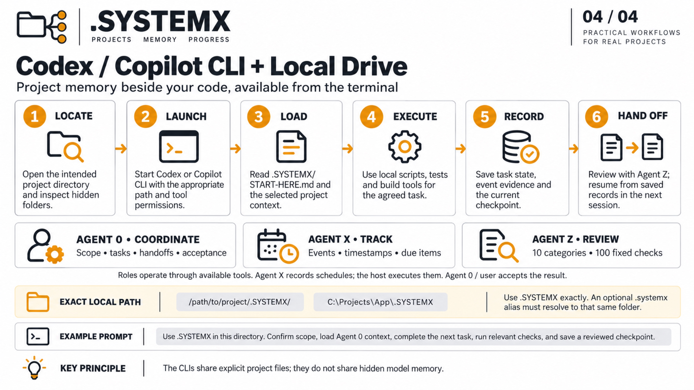

# Codex / Copilot CLI + local drive

[Gallery](../README.md) · [4K JPEG](../Infographics/codex-copilot-cli-local-4k.jpg)

[](../Infographics/codex-copilot-cli-local-4k.jpg)

## Workflow

1. **Locate.** Open the intended project directory and inspect hidden folders.
2. **Launch.** Start Codex or Copilot CLI with the appropriate path and tool permissions.
3. **Load.** Read .SYSTEMX/START-HERE.md and the selected project context.
4. **Execute.** Use local scripts, tests and build tools for the agreed task.
5. **Record.** Save task state, event evidence and the current checkpoint.
6. **Hand Off.** Review with Agent Z; resume from saved records in the next session.

## Agent responsibilities

- **Agent 0:** scope, tasks, handoffs and acceptance within user authority.
- **Agent X:** events, timestamps and due items; the host executes schedules.
- **Agent Z:** the fixed review policy with 10 categories and 100 questions.

These are roles implemented through the available toolchain. The public template
starts with Agent 0 only; [activate Agent X/Z](../../docs/AGENT-X.md) explicitly in
the selected scope. A review score is advisory and does not approve external actions.

Example locations are `/path/to/project/.SYSTEMX/` and
`C:\Projects\App\.SYSTEMX`. Start either CLI in the intended project; keep
its existing instruction discovery and permissions in force. Use `.SYSTEMX`
exactly. An optional `.systemx` alias must resolve to that same directory.
The two CLIs reuse explicit saved files rather than hidden model memory.
Record what checks actually ran and keep Git/backup synchronization explicit.

## Copyable prompt

```text
Use .SYSTEMX in this directory. Confirm scope, load Agent 0 context, complete the next task, run relevant checks, and save a reviewed checkpoint.
```

## Platform reference

Copilot CLI exposes directory trust and tool/path permissions; configure them for the intended project. See [Copilot CLI configuration](https://docs.github.com/en/copilot/how-tos/copilot-cli/set-up-copilot-cli/configure-copilot-cli). Codex also supports selecting a working directory; check your installed CLI help and [Codex CLI documentation](https://learn.chatgpt.com/docs/codex/cli).

Platform references checked 2026-10-04. Availability and permissions depend on
the account, host and configuration. The workflow is a .SYSTEMX usage pattern,
not a built-in integration or third-party endorsement.
