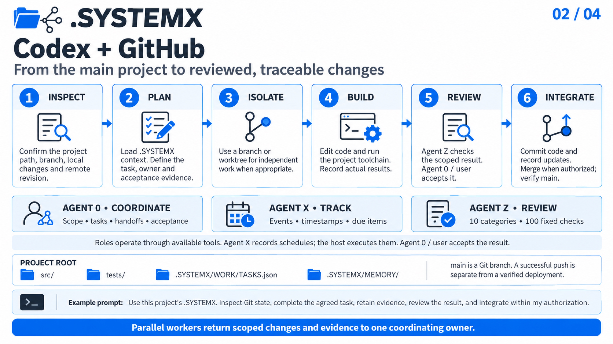

# Codex + GitHub / main project

[Gallery](../README.md) · [4K JPEG](../Infographics/codex-github-main-4k.jpg)

[](../Infographics/codex-github-main-4k.jpg)

## Workflow

1. **Inspect.** Confirm the project path, branch, local changes and remote revision.
2. **Plan.** Load .SYSTEMX context. Define the task, owner and acceptance evidence.
3. **Isolate.** Use a branch or worktree for independent work when appropriate.
4. **Build.** Edit code and run the project toolchain. Record actual results.
5. **Review.** Agent Z checks the scoped result. Agent 0 / user accepts it.
6. **Integrate.** Commit code and record updates. Merge when authorized; verify main.

## Agent responsibilities

- **Agent 0:** scope, tasks, handoffs and acceptance within user authority.
- **Agent X:** events, timestamps and due items; the host executes schedules.
- **Agent Z:** the fixed review policy with 10 categories and 100 questions.

These are roles implemented through the available toolchain. The public template
starts with Agent 0 only; [activate Agent X/Z](../../docs/AGENT-X.md) explicitly in
the selected scope. A review score is advisory and does not approve external actions.

Keep `.SYSTEMX/` beside the host project code and tests. `main` is a Git branch,
not a required directory name. Preserve existing local changes. Coordinate
independent workers with bounded scopes and a common source revision; workers
return changes and evidence to the coordinator. Commit accepted code and record
updates together when appropriate, then check the actual remote revision after
an authorized push or merge. Deployment and runtime verification need their own
evidence when they are part of the task.

## Copyable prompt

```text
Use this project's .SYSTEMX. Inspect Git state, complete the agreed task, retain evidence, review the result, and integrate within my authorization.
```

## Platform reference

Codex worktrees provide separate Git checkouts for independent work. See [Git worktrees](https://learn.chatgpt.com/docs/environments/git-worktrees).

Platform references checked 2026-10-04. Availability and permissions depend on
the account, host and configuration. The workflow is a .SYSTEMX usage pattern,
not a built-in integration or third-party endorsement.
