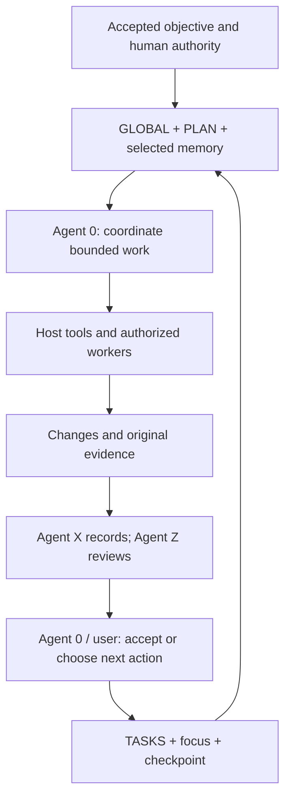
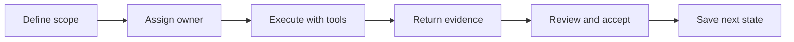

# .SYSTEMX

## White paper: portable project memory for agentic work

**A coordination format for people, AI assistants and the tools that execute their work.**

Edition 1.0 | 4 October 2026 | Technical baseline: v1.8.2-alpha.1

Public discussion paper for founders, engineering teams and AI tooling practitioners.

### Abstract

Agentic projects often span many conversations, tools, people and execution environments. A capable model can still lose the accepted objective, repeat finished investigations, confuse a local check with a live result, or leave its useful findings inside a transient chat. These are coordination and evidence problems as well as model-capability problems.

.SYSTEMX addresses them with a portable folder: explicit context, a Master Plan, a canonical task ledger, scoped agent memory, event records and repeatable review. Agent 0 coordinates work; Agent X records events and time; Agent Z applies a fixed review policy. The host application supplies models, permissions and execution tools.

This paper explains the implemented format, its operating model and its tradeoffs. It proposes a way to evaluate reductions in avoidable context and rework without asserting unmeasured savings. It also describes multi-project isolation, additive version management and adoption across chat, Git, cloud and local terminal workflows.

**Status:** alpha, experimental and subject to change. This is a project-maintained convention, not an externally ratified standard or a production certification. Use at your own risk and retain recoverable backups. [1]

[Public repository](https://github.com/WayneTechLab/dotSYSTEMX) | [User manual](https://github.com/WayneTechLab/dotSYSTEMX/wiki) | [Use-case cards](https://github.com/WayneTechLab/dotSYSTEMX/wiki/Use-Case-Infographics)

## 1. Executive perspective

### From a working folder to a reusable convention

.SYSTEMX began as a practical way to keep local scripts and a TODO folder aligned while working on a project. According to the founder's account, it developed over the following year into a broader convention for project continuity and agent coordination. It grew within a larger Firebase and Google Cloud template, then became a standalone, stack-neutral derivative. The public template preserves source attribution while leaving application choices to each adopter. [2]

The name **DOT SYSTEMX** comes from the folder name **`.SYSTEMX`**. The leading dot conventionally hides it from ordinary macOS and Linux listings; Windows has a separate hidden attribute. Hidden does not mean confidential, encrypted or excluded from version control. Exact casing matters because `.systemx` and `.SYSTEMX` can become different folders on a case-sensitive filesystem.

### The central proposition

A project should not need to reconstruct its working state from an entire conversation history every time a person or model resumes it. Instead, the next session should find the accepted objective, the relevant task, its owner, evidence tied to the actual revision, and the next decision or action.

For a founder, this makes progress easier to inspect: what was intended, what exists, what was checked, what was delivered and what remains unresolved. For an engineering team, it supplies a common record structure around tools it already uses. For an AI harness, it supplies explicit files to read and update within the harness's instruction hierarchy.

### What is delivered today

The implementation includes portable Markdown and JSON records, a Python CLI/library, structural validation, scoped context packets, generated task views, optional Agent X/Z activation, named child projects, and managed installation/update/removal operations. It does not include an LLM runtime, a distributed synchronization service, an OS scheduler or an MCP server. [1, 3]

Continuity across **10,000 or more task-based events** is a design ambition. It is not a measured throughput result or a promise that an application will finish without human decisions. A useful adoption outcome is smaller: resume the right task with sufficient context and trustworthy evidence.

## 2. The problem and the design thesis

### Five recurring failures

| Failure | Practical consequence | .SYSTEMX response |
| --- | --- | --- |
| Objective drift | New work no longer matches the accepted outcome | Global context, acceptance criteria and a Master Plan |
| Repeated discovery | Each chat repeats searches and planning | Reviewed memory, source references and checkpoints |
| Competing status lists | TODO, chat summaries and worker reports disagree | One task ledger with generated views |
| Evidence confusion | A successful build is presented as a verified live service | Revision-specific evidence and distinct delivery stages |
| Handoff loss | The next runtime cannot find the last useful result | Explicit source, scope, revision and next action |

These responses are the project's design choices, not proof that every adopting workflow becomes more reliable. A record can be stale, incomplete or wrong. The operating discipline is to check volatile facts, retain original evidence and identify who owns the canonical update.

### Relevant research, with a bounded inference

Liu and colleagues found that the position of relevant information affected performance on the long-context retrieval and question-answering tasks they evaluated. Their result supports caution about assuming that a longer context window guarantees effective use of all information. It does not evaluate .SYSTEMX or establish the behavior of every current model. [12]

The design inference here is to organize context around the active objective and expose links to deeper evidence. Compression must preserve the information needed for correct work. Removing acceptance criteria to make a prompt shorter can increase total cost through mistakes and repeated attempts.

Anthropic's account of its multi-agent research system describes an orchestrator/worker pattern and reports substantial token overhead in that system. It also identifies coordination and evaluation challenges. This supports treating parallelism as a workload-dependent engineering choice, not a universal efficiency improvement. Those results are not .SYSTEMX benchmarks. [13]

### Design thesis

**Externalize project state, limit each working context to its scope, and require evidence before promoting a claim.** The resulting benefit should be tested at the level of accepted outcomes, including coordination and maintenance overhead.

## 3. Architecture and record ownership

The architecture separates records from execution. Files carry project state and reusable guidance; the selected assistant and its tools perform work. A saved instruction does not launch a process or grant authority. [1, 3]



| Location inside .SYSTEMX | Responsibility |
| --- | --- |
| `GLOBAL/CONTEXT.md` | Project identity, constraints and accepted sources |
| `PLAN/MASTER-PLAN.md` | Outcomes, milestones, dependencies and acceptance |
| `WORK/TASKS.json` | Canonical task ownership, state, history and evidence |
| `WORK/FOCUS.json` | Current objective and selected task/checkpoint pointers |
| `MEMORY/PROJECT.md` | Reviewed durable facts and decisions |
| `AGENTS/<id>/MEMORY.md` | Scoped role or worker continuity |
| `EVENTS/` and `REVIEWS/` | Optional activated event and review records |
| `MEDIA/` | Explanatory assets, not operational task state |

`CURRENT.md` and the TODO, WORKING-ON, BLOCKED, REVIEW, DONE and CANCELLED pages are derived views. Editing those views as independent ledgers creates competing facts. Update the canonical record and regenerate the views instead.

Read the applicable instructions and selected defaults' `START-HERE.md`, then Global context, the Master Plan, project memory, current work and the selected agent's memory. Load additional evidence when relevant. Public seeds remain blank, with Agent 0 registered and no adopted child projects. [1, 4]

## 4. Agent 0 and bounded execution

Agent 0 is the coordination role, not a particular model. It connects an accepted outcome to phases, milestones, dependency-linked tasks and bounded execution waves. A wave is an operating convention for organizing work; it does not introduce another task-state database. [4, 8]

### A useful assignment contract

Every assignment should identify the selected root or child scope, task ID, current source revision, acceptance criteria, allowed actions, relevant references, owned files or interfaces, and the evidence expected on return. Constraints belong in the packet before work starts. A worker should not have to infer whether it may publish, change credentials or modify another project's records.

Workers return scoped changes, checks actually performed, results, unresolved issues and a checkpoint. Agent 0 reconciles those returns with the original criteria and the current shared state. A worker's statement that something is done is a claim to review; it is not acceptance by itself.



### Parallelism and stop conditions

Use separate workers or worktrees for genuinely independent scopes. Avoid assigning simultaneous ownership of the same mutable files. Shared interfaces and dependencies may require a sequential gate before parallel work begins. The documented examples permit up to ten subagents when explicitly authorized, subject to lower host limits; the format itself launches none. [8]

The normal task path is `todo -> in_progress -> needs_review -> done`. Blocked and cancelled states preserve meaningful alternatives. Completion requires evidence and review by Agent 0 or the user under the ledger's rules. [4]

Stop when the accepted scope is satisfied, when the current authorization or resource limit is reached, or when a concrete blocker needs an external decision. Do not invent new work merely to keep agents busy. Reuse unchanged, still-applicable evidence; repeat checks when changed code, environments or unresolved failures justify it.

## 5. Agent X: time, events and the remaining delta

Agent X (`agent.x`) records events and due items across humans, agents, bots, automation and system activity. It does not replace task ownership or run a scheduler. Activation is explicit in the selected scope. [5]

An event preserves a stable retry key, occurrence time, recording time, actor kind/ID, event kind, stage, revision, task references, summary and evidence references. The actor ID is descriptive, not authenticated identity. The CLI checks record consistency; it does not fetch a reference to prove the event occurred.

| Evidence stage | Question answered | What it does not establish |
| --- | --- | --- |
| Planned | What is intended? | That implementation exists |
| Implemented | What changed? | That the relevant checks passed |
| Checked | What was tested, on which revision? | That the change is deployed |
| Deployed | What was delivered, and where? | That the live behavior is correct |
| Live verified | What runtime behavior was observed, when? | That it remains true indefinitely |

The implementation also supports observed, failed and cancelled event stages. These event stages are distinct from task statuses; they are not automatic state transitions. Keeping both prevents a deployment receipt from silently becoming a DONE decision.

### Preserve time rather than rewrite it

`at` records when an event happened; `recordedAt` records when it entered the ledger. Timestamps require an explicit timezone and are stored in UTC. An unchanged replay with the same key reuses the original record; conflicting facts under that key are refused. Corrections should retain earlier observations and explain the new evidence.

`EVENTS/SCHEDULE.json` tracks due occurrences. The external host owns recurrence, timezone rules, execution, retries and notifications. Closing a tracked item does not cancel its remote job or complete an unrelated task.

The useful delta is the gap between intended, implemented, checked, delivered, observed and currently recorded state. Agent X makes that gap inspectable in time; Agent 0 decides the next action. The JSON ledger has bounded reads and is not a streaming event database or a measured 10,000-event performance guarantee. [5]

## 6. Agent Z: a stable review contract

Agent Z (`agent.z`) reviews a prompt, task, change or project against a fixed policy. The default contains **ten categories, ten questions per category and 100 stable question IDs**. The CLI validates answers and computes scores. A human or authorized LLM supplies the judgments and evidence; the tool does not conduct the tests or decide answers. [6]

| ID | Review category |
| --- | --- |
| C01 | Intent and acceptance |
| C02 | Scope and authority |
| C03 | Context and provenance |
| C04 | Planning and dependencies |
| C05 | Correctness and completeness |
| C06 | Verification and evidence |
| C07 | Security and data handling |
| C08 | Usability and documentation |
| C09 | Delivery and operational state |
| C10 | Time, continuity, and delta |

A review identifies the subject, code/input revision, evidence revision, stage and policy snapshot. Every question retains a result, note and evidence list. Results are `pass`, `partial`, `fail`, `unknown` or `not_applicable`. Pass and partial require supporting notes and references; N/A requires a reason and support for non-applicability. Unknown preserves an evidence gap instead of disguising it as confidence.

### Deterministic structure, judgment that still needs scrutiny

The same ordered questions and arithmetic are used for a given policy version. That makes review structure repeatable. It does not make LLM judgments deterministic or guarantee reviewer independence. A reviewer using the same mistaken source as the implementer can reproduce the same error.

The score is advisory. Required acceptance criteria, unresolved critical findings and action permissions remain controlling. A perfect-looking score cannot authorize publication, satisfy a missing legal requirement or certify runtime safety. Review once at a meaningful boundary or when requested; the review itself is not a command to start another build cycle.

## 7. Review scoring, comparison and customization

The main score is earned points out of 100: pass earns 1, partial earns 0.5, and fail, unknown and N/A earn 0. Category scores are out of 10. The report separately preserves applicability, coverage and counts so readers can distinguish quality findings from incomplete review. [6]

```text
Raw points = passes + (0.5 x partials)  [maximum: 100]
Applicable maximum = 100 - not_applicable
Applicable percent = 100 x raw points / applicable maximum
Coverage percent = 100 x (applicable maximum - unknowns)
                   / applicable maximum
```

### Worked example - illustrative, not a product result

A review with 70 passes, 10 partials, 5 failures, 5 unknowns and 10 N/A answers earns **75/100 raw points**. Its applicable percentage is **83.33%**, and coverage is **94.44%**. These numbers do not erase the five failures or five unknowns. A blocking defect can outweigh the aggregate score.

An all-N/A review earns zero raw points; applicable percentage and coverage are undefined. N/A does not receive free credit. Coverage reflects answered applicable questions under the record rules, not independent verification that each cited artifact is genuine or sufficient.

### Compare like with like

The comparison command requires the same subject and policy fingerprint. It reports overall/category score changes, question-level changes, changed notes/evidence and the source/evidence revisions. A changed policy requires a new baseline. A changed live observation may require a new evidence revision even when the code commit is unchanged.

Identical preparation and scoring inputs reuse the retained request/report. If a judgment changes, preserve the earlier report and explain the correction. Scores do not reopen tasks automatically.

After activation, `REVIEWS/POLICY.json` belongs to the adopting project. Teams may adapt question text and supporting policy references while retaining the 10-by-10 shape and stable IDs. Increment the policy version when meaning changes; used versions are frozen. Managed updates preserve project policies and historical answers. They do not silently replace a company's rubric with new defaults.

## 8. Multiple projects and multiple writers

One outer `.SYSTEMX` can hold workspace coordination and shared tools while named children hold separate project records. The child marker is **`.SYSTEMXP`**, used at `Projects/NAME/.SYSTEMXP`. It is not another installation. Explicit selection through `Projects/REGISTRY.json` determines the child being addressed. [7]

```text
Workspace/
  .SYSTEMX/
    GLOBAL/  PLAN/  WORK/  AGENTS/       outer coordination
    Projects/
      REGISTRY.json                     explicit identities
      Project-A/
        .SYSTEMXP/                      Project A records
      Project-B/
        .SYSTEMXP/                      Project B records
```

The same task ID can exist in different children. Handoffs should therefore identify the project as well as the task, source and revision. Code can live beside a child's record marker or in an explicitly referenced repository. Do not infer a child's identity from the last conversation, load sibling memory by default, or install `.SYSTEMX` recursively inside itself.

### Synchronization is a workflow responsibility

A folder shared through Git, Drive or another storage system is a rendezvous point for records. It is not a distributed transaction manager. The local coordination lock protects cooperating command writers on that filesystem; it does not serialize independent Git worktrees, offline sync clients or manual editors. [7, 9]

| Situation | Recommended ownership rule |
| --- | --- |
| Several chats on one project | One canonical writer integrates proposed changes |
| Separate independent projects | One explicitly selected owner per child scope |
| Git branches or worktrees | Workers return scoped diffs; coordinator reconciles records |
| Offline or cloud snapshots | Include revision and freshness; check before writing back |

A useful handoff packet includes scope, task ID, input revision, owned changes, evidence/run IDs, unresolved items and the next checkpoint. Check for intervening changes before applying it. Do not use last-write-wins file replacement as a substitute for reconciling two task histories.

## 9. One format across four execution environments

The portable records stay conceptually consistent while access, execution and persistence vary by host. The four media cards illustrate these usage patterns; they are not claims that .SYSTEMX ships connectors for these products. [9, 10]

| Environment | Where useful context lives | Execution and persistence boundary |
| --- | --- | --- |
| ChatGPT + Google Drive | An authorized folder or current exported packet | Read/write capability depends on available tools. Without write access, return proposed changes for the owner to save and verify. |
| Codex + GitHub | The selected checkout and its .SYSTEMX records | Inspect branch, changes and revision. Integrate accepted code/record changes within authorization; verify the remote result. |
| Dots / Codex Cloud | An explicit source loaded into the selected runtime | Cloud and local files are distinct. Persist a reviewed handoff to the canonical source before replacing the runtime. |
| Codex / Copilot CLI + local drive | A selected local project directory | Apply the CLI's directory and tool permissions. Save actual records/checkpoints; synchronization or backup is a separate operation. |

### Access is part of the task contract

A URL locates a source. It does not grant permission, guarantee recursive access, make local files available in a cloud task or prove that a write persisted. The assistant should state which source and revision it actually read, which tools can act on it and how the result was read back.

Likewise, Git `main` is a branch, not a required directory named `/main`. A pushed commit is source-delivery evidence; live service behavior requires a separate observation when relevant to the acceptance criteria.

For a bot on a VM or physical computer, a local `.SYSTEMX` can provide durable state between runs. The bot still needs an authorized runtime, configured tools, credentials, a scheduler when required, and a clear writer policy. Merely adding the folder does not create an always-on service.

A shared project memory can resemble an operational team notebook. It does not merge the hidden memories of different models, retrain their weights or establish an AGI capability. Better continuity depends on useful saved facts and disciplined review.

## 10. Adoption, versions and reversible lifecycle

The document format works without executing Python. Optional command tools require Python 3.9 or later and use the standard library at runtime; prefer a maintained interpreter. Install into an explicit project, directory, locally available Drive folder or chat-export workflow. Review the destination before adoption. [3, 11]

### First use

1. Identify the intended root and inspect hidden paths for casing conflicts.
2. Select a reviewed release and preview first-run/setup behavior.
3. Apply installation within the task's authorization, then record the project's real purpose, owner, constraints and acceptance criteria.
4. Configure only the checks and commands the project actually uses.
5. Create a small first task and verify that saved state can be resumed.
6. Activate Agent X/Z explicitly when their records and review workflow are useful.

The public distribution starts blank. It does not inherit an application's credentials, cloud deployment, private memory or task history. The optional lowercase sibling alias `.systemx -> .SYSTEMX` may provide compatibility where supported; an independent second lowercase directory is a conflict to resolve deliberately.

### Preserve user-owned data

Managed installation records the selected release and retains immutable default snapshots under `.SYSTEMX/.systemx/releases/<version>/`. Updates create missing files and add a new snapshot; they do not overwrite existing root files or delete directories removed upstream. The outer copied `VERSION` can therefore differ from the selected defaults recorded in `INSTALLATION.json`.

New managed installations are pinned and manual by default. Startup update checking is an explicit opt-in, not a background OS scheduler. Alpha updates can change interfaces; a pin, reviewed migration and recoverable backup remain useful controls. Existing project review policies are not automatically rewritten.

Uninstall inventories the installation, moves it to an external backup on the same filesystem and writes a receipt. Restore verifies the backup and refuses an occupied destination. Removing a separate Python package, a manually configured host instruction or an external schedule requires its own scoped action. Release hashes detect consistency relative to a source; they are not independent publisher signatures. [11]

## 11. Token use, cost and elapsed time

.SYSTEMX is not a token compressor, billing meter or model cache. Its efficiency hypothesis is that selected context, clear ownership and reusable evidence can reduce unnecessary input and repeated work. Maintaining the records, running reviews and coordinating workers also costs time and tokens. Evaluate the net result. [3]

### Illustrative arithmetic, not measured savings

Replacing a 20,000-token resume packet with an equally sufficient 5,000-token packet avoids 15,000 input tokens per request. Across 100 requests, that is 1.5 million input tokens. At an uncached input rate of R currency units per million tokens, the input-only difference is 1.5 x R. This is not a claim of a 75% reduction in total cost or elapsed time.

```text
Task cost = sum of provider-reported billable usage components
            x their applicable rates + tool/infrastructure charges
Cost per accepted outcome = total task cost / accepted outcomes
```

Use the provider's actual accounting categories without double counting. Include worker calls, retries, coordination, review, cache writes/reads and output or reasoning charges where separately billed. Fixed-price subscriptions may yield more available capacity without changing the subscription bill.

### Shorter input is only one variable

OpenAI's latency guidance distinguishes input processing from generation and other work; input reduction does not imply a proportional end-to-end speedup. Its caching documentation also makes clear that reuse depends on the rendered prefix and relevant settings. Rewriting or compacting context can alter cache reuse. These provider-specific mechanisms need measurement in the chosen model and harness. [14, 15]

The current context tooling bounds excerpts by **characters**, not tokens: individual document excerpts up to 6,000 characters, relevant-task summaries up to 2,000 each and at most 25 displayed tasks. Worker packets bound the JSON excerpt and selected memory separately. Truncation requires following references for omitted acceptance criteria or evidence. Do not load the entire media library, policy history or every agent memory on each turn. [3, 4]

The strongest candidate for a time saving is avoiding an unnecessary investigation or invalid implementation cycle. A smaller prompt that causes a missed requirement can be more expensive overall. Parallel workers should be justified by independent work and outcome value, not by a desired agent count.

## 12. Example: a 20-page web application

This is an illustrative execution plan, not a completed deployment or a one-response guarantee. A deep-research brief can start the project, but the brief should distinguish verified sources, assumptions, decisions still needed, non-goals, constraints and measurable acceptance. Relevant information is useful; indiscriminate prompt volume is not the objective. [8]

A route inventory can group twenty pages into public information, product content, account flows and operational views. Only include authentication, billing or cloud services if the actual product requires them. Record which routes are static, which depend on data and which require specific user permissions.

| Phase / wave | Main work | Acceptance evidence |
| --- | --- | --- |
| 1. Discovery | Research, audience, route inventory, constraints | Accepted brief, source references and explicit unknowns |
| 2. Foundation | Architecture, design system, data/tool contracts | Reviewed interfaces and a working application skeleton |
| 3. Independent implementation | Bounded page groups or services | Scoped diffs and relevant component/contract checks |
| 4. Integration | Navigation, data flows, accessibility and error states | End-to-end evidence against the selected revision |
| 5. Delivery | Authorized release and runtime inspection | Delivery receipt, live observations and recovery plan |
| 6. Closure | Resolve remaining gaps; preserve handoff | Accepted tasks, review findings and maintenance checkpoint |

Agent 0 converts these phases into dependency-linked tasks. Independent page groups can be assigned in parallel after their shared contracts are stable. Agent X records actual check and delivery attempts, including failures. Agent Z reviews the initial brief when requested and the result at meaningful completion boundaries using the same policy version.

Suppose a UI passes locally but the live site serves an earlier build. The remaining delta is delivery/runtime state, not a reason to redesign the already accepted UI. The next task is to identify and resolve that specific discrepancy within authorization, then attach the new evidence revision. Do not erase the earlier observations.

Completion means the agreed route and behavior criteria are supported by evidence, required findings are resolved, and known limitations or deferred work are explicitly accepted by the appropriate owner. It does not mean every conceivable feature has been added or that a score reached an arbitrary threshold.

## 13. Reliability, security and evaluation

### Know what each kind of evidence proves

| Evidence | Supports | Does not prove |
| --- | --- | --- |
| Template validation | Record shape, selected consistency and blank public seeds | Secret-free content or downstream production readiness |
| Unit/package tests | Tested implementation behavior in stated environments | Every cloud connector or future filesystem behavior |
| Agent Z report | Recorded judgments under a known policy and evidence revision | Independent authenticity or correctness of every judgment |
| Runtime observation | Behavior seen at a specified time and target | Permanent liveness or broader acceptance outside its scope |

The v1.8.2 baseline's published release report records a 143-test local suite with five filesystem-dependent skips, six platform jobs on each of main and Alpha1, package checks, preservation through upgrade, and uninstall/restore checks. That is evidence about the template implementation and packaging. It is not a field study of token savings, drift prevention or long-horizon autonomous completion. [16]

### Principal failure modes

Stale memory can conceal a changed requirement. Over-compressed packets can omit a critical constraint. Independent writers can lose each other's updates. A shared reviewer can repeat the implementer's bias. Public Git or cloud shares can disclose confidential context. A high score can hide a blocking defect if readers ignore individual findings.

Treat imported material and tool output as data within the host's instruction hierarchy. Keep secrets outside shared records, scope tools and writers, retain original evidence and recheck volatile claims. Local files and recorded actor IDs are not a signed audit system. Compliance, sensitive deployment and regulated use require controls beyond this template. [1, 5, 6, 9]

### A proposed evaluation protocol

Compare matched tasks with and without the format, holding model, tool access, task scope and acceptance criteria as constant as practical. Use repeated trials and report variation. Measure accepted-outcome rate, total billable usage, elapsed time, duplicate work, invalid assumptions, human corrections and record-maintenance effort. Include failed trials, interruptions and cross-session resumptions. Predefine evaluation criteria and use an independent reviewer where feasible. No result from that proposed study is claimed here.

## 14. Adoption decisions and development direction

Start with a small real project and one writer. Establish a baseline, complete one task, interrupt the session and test whether a second session can resume correctly. Add child projects, event records and formal review only when their coordination value justifies their overhead. The format should help the work finish, not create a permanent administrative loop.

### A first-session prompt

```text
Use this project's existing .SYSTEMX. Inspect the exact path,
selected defaults, source revision and current local changes.
Read applicable instructions, START-HERE, Global context,
the Master Plan, current work and relevant agent memory.
Confirm the accepted objective and choose the next bounded task.
Use only available, authorized tools. Delegate only when authorized.
Run the checks relevant to the change and preserve original evidence.
Use Agent X/Z if activated and applicable. Save the canonical task
update and checkpoint; report the remaining delta or completion.
Do not claim a persisted change without a successful write/readback.
```

### What the project could add later

Potential extensions include an MCP interface, storage-specific adapters, signed evidence, stronger concurrency controls, archive/index support and empirical efficiency benchmarks. These are proposed directions, not shipped capabilities or delivery commitments. Any adapter should preserve explicit scope selection, version provenance, authority boundaries and additive ownership rules.

An MCP endpoint could expose existing context, task, event and review operations to a compatible host. It would still need authentication, access control, idempotency, data-classification rules, conflict handling and evaluation. Calling a file format through MCP would not create a new model capability by itself.

### Adoption criterion

Use .SYSTEMX when a project benefits from a durable answer to five questions: **What are we doing? What is accepted? What actually happened? What evidence supports it? What happens next?** The long-term objective is more reliable completion with less avoidable rework. Whether a particular team saves money or time remains a question for that team's measured workflow.

## References and document provenance

This edition describes the implemented runtime and record behavior at **v1.8.2-alpha.1**, source commit `59bc3abee59539a721a295288ff1ed266d82eb0f`. The paper is published with the documentation-only v1.8.3-alpha.1 release; this does not add an execution feature. Source links below pin implementation references to the examined baseline. Live platform documentation was checked on 4 October 2026.

[1] .SYSTEMX, [Standard and authority boundaries](https://github.com/WayneTechLab/dotSYSTEMX/blob/v1.8.2-alpha.1/.SYSTEMX/STANDARD.md), and [Format contract](https://github.com/WayneTechLab/dotSYSTEMX/blob/v1.8.2-alpha.1/.SYSTEMX/FORMAT.md).

[2] .SYSTEMX, [About and founder's account](https://github.com/WayneTechLab/dotSYSTEMX/blob/v1.8.2-alpha.1/.SYSTEMX/docs/ABOUT.md), and [source provenance](https://github.com/WayneTechLab/dotSYSTEMX/blob/v1.8.2-alpha.1/.SYSTEMX/SOURCE.json).

[3] .SYSTEMX, [Technical Guide](https://github.com/WayneTechLab/dotSYSTEMX/blob/v1.8.2-alpha.1/.SYSTEMX/docs/TECHNICAL-GUIDE.md), and [Efficiency guide](https://github.com/WayneTechLab/dotSYSTEMX/blob/v1.8.2-alpha.1/.SYSTEMX/docs/EFFICIENCY.md).

[4] .SYSTEMX, [Agent coordination](https://github.com/WayneTechLab/dotSYSTEMX/blob/v1.8.2-alpha.1/.SYSTEMX/AGENTS/README.md), and [project-memory implementation](https://github.com/WayneTechLab/dotSYSTEMX/blob/v1.8.2-alpha.1/.SYSTEMX/scripts/project_memory.py).

[5] .SYSTEMX, [Agent X specification](https://github.com/WayneTechLab/dotSYSTEMX/blob/v1.8.2-alpha.1/.SYSTEMX/docs/AGENT-X.md).

[6] .SYSTEMX, [Agent Z specification](https://github.com/WayneTechLab/dotSYSTEMX/blob/v1.8.2-alpha.1/.SYSTEMX/docs/AGENT-Z.md), [default policy](https://github.com/WayneTechLab/dotSYSTEMX/blob/v1.8.2-alpha.1/.SYSTEMX/config/agent-z-policy.json), and [scoring implementation](https://github.com/WayneTechLab/dotSYSTEMX/blob/v1.8.2-alpha.1/.SYSTEMX/scripts/agent_z.py).

[7] .SYSTEMX, [SYSTEMX PROJECTS](https://github.com/WayneTechLab/dotSYSTEMX/blob/v1.8.2-alpha.1/.SYSTEMX/docs/PROJECTS.md).

[8] .SYSTEMX, [One-shot project guide](https://github.com/WayneTechLab/dotSYSTEMX/blob/v1.8.2-alpha.1/.SYSTEMX/docs/ONE-SHOT-PROJECT.md).

[9] .SYSTEMX, [Shared workspaces, clouds and bots](https://github.com/WayneTechLab/dotSYSTEMX/blob/v1.8.2-alpha.1/.SYSTEMX/docs/SHARED-WORKSPACES.md).

[10] .SYSTEMX, [Four use-case cards and guides](https://github.com/WayneTechLab/dotSYSTEMX/tree/v1.8.2-alpha.1/.SYSTEMX/MEDIA).

[11] .SYSTEMX, [Installation](https://github.com/WayneTechLab/dotSYSTEMX/blob/v1.8.2-alpha.1/.SYSTEMX/docs/INSTALLATION.md), [release policy](https://github.com/WayneTechLab/dotSYSTEMX/blob/v1.8.2-alpha.1/.SYSTEMX/docs/RELEASE-POLICY.md), and [uninstall/restore](https://github.com/WayneTechLab/dotSYSTEMX/blob/v1.8.2-alpha.1/.SYSTEMX/docs/UNINSTALL.md).

[12] Nelson F. Liu et al., [Lost in the Middle: How Language Models Use Long Contexts](https://arxiv.org/abs/2307.03172v3), 2023. Findings concern the evaluated models and tasks, not .SYSTEMX.

[13] Anthropic, [How we built our multi-agent research system](https://www.anthropic.com/engineering/multi-agent-research-system), 13 June 2025. An external system report, not a .SYSTEMX evaluation.

[14] OpenAI, [Latency optimization](https://developers.openai.com/api/docs/guides/latency-optimization), live documentation accessed 4 October 2026.

[15] OpenAI, [Prompt caching](https://developers.openai.com/api/docs/guides/prompt-caching), live documentation accessed 4 October 2026.

[16] .SYSTEMX, [v1.8.2-alpha.1 release verification report](https://github.com/WayneTechLab/dotSYSTEMX/releases/download/v1.8.2-alpha.1/PUBLIC-REVIEW-1.8.2-alpha.1.json).

**Publication notes.** This is an independently authored project white paper, not a peer-reviewed research result or a vendor endorsement. The Markdown source is the editable text; the PDF is its typeset edition with vector diagrams, page numbers and clickable references. The source and PDF are licensed with this repository under MIT. Provider names remain their owners' marks. Paper edition numbers are separate from template versions. Future editions should use new filenames so additive updates preserve existing local copies.
