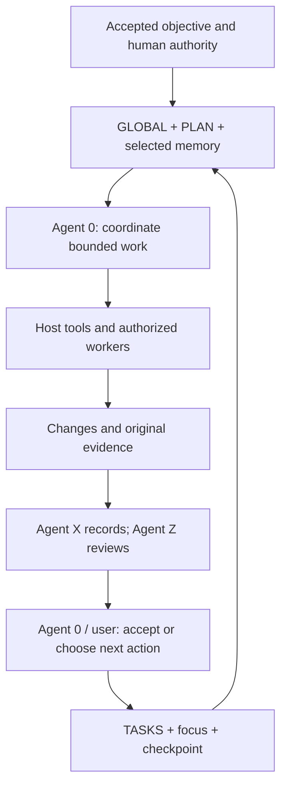
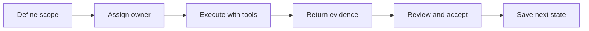

# .SYSTEMX

## White paper: portable project memory for agentic work

**A coordination format for people, AI assistants and the tools that execute their work.**

Edition 1.1 | 4 October 2026 | Technical baseline: v1.8.3-alpha.1

Expanded implementation reference for founders, engineering teams and AI tooling practitioners. Edition 1.0 remains available as the shorter introduction.

### Abstract

Agentic projects often span many conversations, tools, people and execution environments. A capable model can still lose the accepted objective, repeat finished investigations, confuse a local check with a live result, or leave its useful findings inside a transient chat. These are coordination and evidence problems as well as model-capability problems.

.SYSTEMX addresses them with a portable folder: explicit context, a Master Plan, a canonical task ledger, scoped agent memory, event records and repeatable review. Agent 0 coordinates work; Agent X records events and time; Agent Z applies a fixed review policy. The host application supplies models, permissions and execution tools.

This expanded paper explains the implemented format, its operating model, exact record contracts and coordination mechanics. It includes a tested local task walkthrough, the complete default 100-question review policy and a baseline file inventory. It proposes a way to evaluate reductions in avoidable context and rework without asserting unmeasured savings. It also describes multi-project isolation, additive version management and adoption across chat, Git, cloud and local terminal workflows.

**Status:** alpha, experimental and subject to change. This is a project-maintained convention, not an externally ratified standard or a production certification. Use at your own risk and retain recoverable backups. [1]

[Public repository](https://github.com/WayneTechLab/dotSYSTEMX) | [User manual](https://github.com/WayneTechLab/dotSYSTEMX/wiki) | [Use-case cards](https://github.com/WayneTechLab/dotSYSTEMX/wiki/Use-Case-Infographics)

## 1. Executive perspective

### From a working folder to a reusable convention

.SYSTEMX began as a practical way to keep local scripts and a TODO folder aligned while working on a project. According to the founder's account, it developed over the following year into a broader convention for project continuity and agent coordination. It grew within a larger Firebase and Google Cloud template, then became a standalone, stack-neutral derivative. The public template preserves source attribution while leaving application choices to each adopter. [2]

The name **DOT SYSTEMX** comes from the folder name **`.SYSTEMX`**. The leading dot conventionally hides it from ordinary macOS and Linux listings; Windows has a separate hidden attribute. Hidden does not mean confidential, encrypted or excluded from version control. Exact casing matters because `.systemx` and `.SYSTEMX` can become different folders on a case-sensitive filesystem.

### The central proposition

A project should not need to reconstruct its working state from an entire conversation history every time a person or model resumes it. Instead, the next session should find the accepted objective, the relevant task, its owner, evidence tied to the actual revision, and the next decision or action.

For a founder, this makes progress easier to inspect: what was intended, what exists, what was checked, what was delivered and what remains unresolved. For an engineering team, it supplies a common record structure around tools it already uses. For an AI harness, it supplies explicit files to read and update within the harness's instruction hierarchy.

### What is delivered today

The implementation includes portable Markdown and JSON records, a Python CLI/library, structural validation, scoped context packets, generated task views, optional Agent X/Z activation, named child projects, and managed installation/update/removal operations. It does not include an LLM runtime, a distributed synchronization service, an OS scheduler or an MCP server. [1, 3]

Continuity across **10,000 or more task-based events** is a design ambition. It is not a measured throughput result or a promise that an application will finish without human decisions. A useful adoption outcome is smaller: resume the right task with sufficient context and trustworthy evidence.

## 2. The problem and the design thesis

### Five recurring failures

| Failure | Practical consequence | .SYSTEMX response |
| --- | --- | --- |
| Objective drift | New work no longer matches the accepted outcome | Global context, acceptance criteria and a Master Plan |
| Repeated discovery | Each chat repeats searches and planning | Reviewed memory, source references and checkpoints |
| Competing status lists | TODO, chat summaries and worker reports disagree | One task ledger with generated views |
| Evidence confusion | A successful build is presented as a verified live service | Revision-specific evidence and distinct delivery stages |
| Handoff loss | The next runtime cannot find the last useful result | Explicit source, scope, revision and next action |

These responses are the project's design choices, not proof that every adopting workflow becomes more reliable. A record can be stale, incomplete or wrong. The operating discipline is to check volatile facts, retain original evidence and identify who owns the canonical update.

### Relevant research, with a bounded inference

Liu and colleagues found that the position of relevant information affected performance on the long-context retrieval and question-answering tasks they evaluated. Their result supports caution about assuming that a longer context window guarantees effective use of all information. It does not evaluate .SYSTEMX or establish the behavior of every current model. [12]

The design inference here is to organize context around the active objective and expose links to deeper evidence. Compression must preserve the information needed for correct work. Removing acceptance criteria to make a prompt shorter can increase total cost through mistakes and repeated attempts.

Anthropic's account of its multi-agent research system describes an orchestrator/worker pattern and reports substantial token overhead in that system. It also identifies coordination and evaluation challenges. This supports treating parallelism as a workload-dependent engineering choice, not a universal efficiency improvement. Those results are not .SYSTEMX benchmarks. [13]

### Design thesis

**Externalize project state, limit each working context to its scope, and require evidence before promoting a claim.** The resulting benefit should be tested at the level of accepted outcomes, including coordination and maintenance overhead.

## 3. Architecture and record ownership

The architecture separates records from execution. Files carry project state and reusable guidance; the selected assistant and its tools perform work. A saved instruction does not launch a process or grant authority. [1, 3]



| Location inside .SYSTEMX | Responsibility |
| --- | --- |
| `GLOBAL/CONTEXT.md` | Project identity, constraints and accepted sources |
| `PLAN/MASTER-PLAN.md` | Outcomes, milestones, dependencies and acceptance |
| `WORK/TASKS.json` | Canonical task ownership, state, history and evidence |
| `WORK/FOCUS.json` | Current objective and selected task/checkpoint pointers |
| `MEMORY/PROJECT.md` | Reviewed durable facts and decisions |
| `AGENTS/<id>/MEMORY.md` | Scoped role or worker continuity |
| `EVENTS/` and `REVIEWS/` | Optional activated event and review records |
| `MEDIA/` | Explanatory assets, not operational task state |

`CURRENT.md` and the TODO, WORKING-ON, BLOCKED, REVIEW, DONE and CANCELLED pages are derived views. Editing those views as independent ledgers creates competing facts. Update the canonical record and regenerate the views instead.

Read the applicable instructions and selected defaults' `START-HERE.md`, then Global context, the Master Plan, project memory, current work and the selected agent's memory. Load additional evidence when relevant. Public seeds remain blank, with Agent 0 registered and no adopted child projects. [1, 4]

## 4. Agent 0 and bounded execution

Agent 0 is the coordination role, not a particular model. It connects an accepted outcome to phases, milestones, dependency-linked tasks and bounded execution waves. A wave is an operating convention for organizing work; it does not introduce another task-state database. [4, 8]

### A useful assignment contract

Every assignment should identify the selected root or child scope, task ID, current source revision, acceptance criteria, allowed actions, relevant references, owned files or interfaces, and the evidence expected on return. Constraints belong in the packet before work starts. A worker should not have to infer whether it may publish, change credentials or modify another project's records.

Workers return scoped changes, checks actually performed, results, unresolved issues and a checkpoint. Agent 0 reconciles those returns with the original criteria and the current shared state. A worker's statement that something is done is a claim to review; it is not acceptance by itself.



### Parallelism and stop conditions

Use separate workers or worktrees for genuinely independent scopes. Avoid assigning simultaneous ownership of the same mutable files. Shared interfaces and dependencies may require a sequential gate before parallel work begins. The documented examples permit up to ten subagents when explicitly authorized, subject to lower host limits; the format itself launches none. [8]

The normal task path is `todo -> in_progress -> needs_review -> done`. Blocked and cancelled states preserve meaningful alternatives. Completion requires evidence and review by Agent 0 or the user under the ledger's rules. [4]

Stop when the accepted scope is satisfied, when the current authorization or resource limit is reached, or when a concrete blocker needs an external decision. Do not invent new work merely to keep agents busy. Reuse unchanged, still-applicable evidence; repeat checks when changed code, environments or unresolved failures justify it.

## 5. Agent X: time, events and the remaining delta

Agent X (`agent.x`) records events and due items across humans, agents, bots, automation and system activity. It does not replace task ownership or run a scheduler. Activation is explicit in the selected scope. [5]

An event preserves a stable retry key, occurrence time, recording time, actor kind/ID, event kind, stage, revision, task references, summary and evidence references. The actor ID is descriptive, not authenticated identity. The CLI checks record consistency; it does not fetch a reference to prove the event occurred.

| Evidence stage | Question answered | What it does not establish |
| --- | --- | --- |
| Planned | What is intended? | That implementation exists |
| Implemented | What changed? | That the relevant checks passed |
| Checked | What was tested, on which revision? | That the change is deployed |
| Deployed | What was delivered, and where? | That the live behavior is correct |
| Live verified | What runtime behavior was observed, when? | That it remains true indefinitely |

The implementation also supports observed, failed and cancelled event stages. These event stages are distinct from task statuses; they are not automatic state transitions. Keeping both prevents a deployment receipt from silently becoming a DONE decision.

### Preserve time rather than rewrite it

`at` records when an event happened; `recordedAt` records when it entered the ledger. Timestamps require an explicit timezone and are stored in UTC. An unchanged replay with the same key reuses the original record; conflicting facts under that key are refused. Corrections should retain earlier observations and explain the new evidence.

`EVENTS/SCHEDULE.json` tracks due occurrences. The external host owns recurrence, timezone rules, execution, retries and notifications. Closing a tracked item does not cancel its remote job or complete an unrelated task.

The useful delta is the gap between intended, implemented, checked, delivered, observed and currently recorded state. Agent X makes that gap inspectable in time; Agent 0 decides the next action. The JSON ledger has bounded reads and is not a streaming event database or a measured 10,000-event performance guarantee. [5]

## 6. Agent Z: a stable review contract

Agent Z (`agent.z`) reviews a prompt, task, change or project against a fixed policy. The default contains **ten categories, ten questions per category and 100 stable question IDs**. The CLI validates answers and computes scores. A human or authorized LLM supplies the judgments and evidence; the tool does not conduct the tests or decide answers. [6]

| ID | Review category |
| --- | --- |
| C01 | Intent and acceptance |
| C02 | Scope and authority |
| C03 | Context and provenance |
| C04 | Planning and dependencies |
| C05 | Correctness and completeness |
| C06 | Verification and evidence |
| C07 | Security and data handling |
| C08 | Usability and documentation |
| C09 | Delivery and operational state |
| C10 | Time, continuity, and delta |

A review identifies the subject, code/input revision, evidence revision, stage and policy snapshot. Every question retains a result, note and evidence list. Results are `pass`, `partial`, `fail`, `unknown` or `not_applicable`. Pass and partial require supporting notes and references; N/A requires a reason and support for non-applicability. Unknown preserves an evidence gap instead of disguising it as confidence.

### Deterministic structure, judgment that still needs scrutiny

The same ordered questions and arithmetic are used for a given policy version. That makes review structure repeatable. It does not make LLM judgments deterministic or guarantee reviewer independence. A reviewer using the same mistaken source as the implementer can reproduce the same error.

The score is advisory. Required acceptance criteria, unresolved critical findings and action permissions remain controlling. A perfect-looking score cannot authorize publication, satisfy a missing legal requirement or certify runtime safety. Review once at a meaningful boundary or when requested; the review itself is not a command to start another build cycle.

## 7. Review scoring, comparison and customization

The main score is earned points out of 100: pass earns 1, partial earns 0.5, and fail, unknown and N/A earn 0. Category scores are out of 10. The report separately preserves applicability, coverage and counts so readers can distinguish quality findings from incomplete review. [6]

```text
Raw points = passes + (0.5 x partials)  [maximum: 100]
Applicable maximum = 100 - not_applicable
Applicable percent = 100 x raw points / applicable maximum
Coverage percent = 100 x (applicable maximum - unknowns)
                   / applicable maximum
```

### Worked example - illustrative, not a product result

A review with 70 passes, 10 partials, 5 failures, 5 unknowns and 10 N/A answers earns **75/100 raw points**. Its applicable percentage is **83.33%**, and coverage is **94.44%**. These numbers do not erase the five failures or five unknowns. A blocking defect can outweigh the aggregate score.

An all-N/A review earns zero raw points; applicable percentage and coverage are undefined. N/A does not receive free credit. Coverage reflects answered applicable questions under the record rules, not independent verification that each cited artifact is genuine or sufficient.

### Compare like with like

The comparison command requires the same subject and policy fingerprint. It reports overall/category score changes, question-level changes, changed notes/evidence and the source/evidence revisions. A changed policy requires a new baseline. A changed live observation may require a new evidence revision even when the code commit is unchanged.

Identical preparation and scoring inputs reuse the retained request/report. If a judgment changes, preserve the earlier report and explain the correction. Scores do not reopen tasks automatically.

After activation, `REVIEWS/POLICY.json` belongs to the adopting project. Teams may adapt question text and supporting policy references while retaining the 10-by-10 shape and stable IDs. Increment the policy version when meaning changes; used versions are frozen. Managed updates preserve project policies and historical answers. They do not silently replace a company's rubric with new defaults.

## 8. Multiple projects and multiple writers

One outer `.SYSTEMX` can hold workspace coordination and shared tools while named children hold separate project records. The child marker is **`.SYSTEMXP`**, used at `Projects/NAME/.SYSTEMXP`. It is not another installation. Explicit selection through `Projects/REGISTRY.json` determines the child being addressed. [7]

```text
Workspace/
  .SYSTEMX/
    GLOBAL/  PLAN/  WORK/  AGENTS/       outer coordination
    Projects/
      REGISTRY.json                     explicit identities
      Project-A/
        .SYSTEMXP/                      Project A records
      Project-B/
        .SYSTEMXP/                      Project B records
```

The same task ID can exist in different children. Handoffs should therefore identify the project as well as the task, source and revision. Code can live beside a child's record marker or in an explicitly referenced repository. Do not infer a child's identity from the last conversation, load sibling memory by default, or install `.SYSTEMX` recursively inside itself.

### Synchronization is a workflow responsibility

A folder shared through Git, Drive or another storage system is a rendezvous point for records. It is not a distributed transaction manager. The local coordination lock protects cooperating command writers on that filesystem; it does not serialize independent Git worktrees, offline sync clients or manual editors. [7, 9]

| Situation | Recommended ownership rule |
| --- | --- |
| Several chats on one project | One canonical writer integrates proposed changes |
| Separate independent projects | One explicitly selected owner per child scope |
| Git branches or worktrees | Workers return scoped diffs; coordinator reconciles records |
| Offline or cloud snapshots | Include revision and freshness; check before writing back |

A useful handoff packet includes scope, task ID, input revision, owned changes, evidence/run IDs, unresolved items and the next checkpoint. Check for intervening changes before applying it. Do not use last-write-wins file replacement as a substitute for reconciling two task histories.

## 9. One format across four execution environments

The portable records stay conceptually consistent while access, execution and persistence vary by host. The four media cards illustrate these usage patterns; they are not claims that .SYSTEMX ships connectors for these products. [9, 10]

| Environment | Where useful context lives | Execution and persistence boundary |
| --- | --- | --- |
| ChatGPT + Google Drive | An authorized folder or current exported packet | Read/write capability depends on available tools. Without write access, return proposed changes for the owner to save and verify. |
| Codex + GitHub | The selected checkout and its .SYSTEMX records | Inspect branch, changes and revision. Integrate accepted code/record changes within authorization; verify the remote result. |
| Dots / Codex Cloud | An explicit source loaded into the selected runtime | Cloud and local files are distinct. Persist a reviewed handoff to the canonical source before replacing the runtime. |
| Codex / Copilot CLI + local drive | A selected local project directory | Apply the CLI's directory and tool permissions. Save actual records/checkpoints; synchronization or backup is a separate operation. |

### Access is part of the task contract

A URL locates a source. It does not grant permission, guarantee recursive access, make local files available in a cloud task or prove that a write persisted. The assistant should state which source and revision it actually read, which tools can act on it and how the result was read back.

Likewise, Git `main` is a branch, not a required directory named `/main`. A pushed commit is source-delivery evidence; live service behavior requires a separate observation when relevant to the acceptance criteria.

For a bot on a VM or physical computer, a local `.SYSTEMX` can provide durable state between runs. The bot still needs an authorized runtime, configured tools, credentials, a scheduler when required, and a clear writer policy. Merely adding the folder does not create an always-on service.

A shared project memory can resemble an operational team notebook. It does not merge the hidden memories of different models, retrain their weights or establish an AGI capability. Better continuity depends on useful saved facts and disciplined review.

## 10. Adoption, versions and reversible lifecycle

The document format works without executing Python. Optional command tools require Python 3.9 or later and use the standard library at runtime; prefer a maintained interpreter. Install into an explicit project, directory, locally available Drive folder or chat-export workflow. Review the destination before adoption. [3, 11]

### First use

1. Identify the intended root and inspect hidden paths for casing conflicts.
2. Select a reviewed release and preview first-run/setup behavior.
3. Apply installation within the task's authorization, then record the project's real purpose, owner, constraints and acceptance criteria.
4. Configure only the checks and commands the project actually uses.
5. Create a small first task and verify that saved state can be resumed.
6. Activate Agent X/Z explicitly when their records and review workflow are useful.

The public distribution starts blank. It does not inherit an application's credentials, cloud deployment, private memory or task history. The optional lowercase sibling alias `.systemx -> .SYSTEMX` may provide compatibility where supported; an independent second lowercase directory is a conflict to resolve deliberately.

### Preserve user-owned data

Managed installation records the selected release and retains immutable default snapshots under `.SYSTEMX/.systemx/releases/<version>/`. Updates create missing files and add a new snapshot; they do not overwrite existing root files or delete directories removed upstream. The outer copied `VERSION` can therefore differ from the selected defaults recorded in `INSTALLATION.json`.

New managed installations are pinned and manual by default. Startup update checking is an explicit opt-in, not a background OS scheduler. Alpha updates can change interfaces; a pin, reviewed migration and recoverable backup remain useful controls. Existing project review policies are not automatically rewritten.

Uninstall inventories the installation, moves it to an external backup on the same filesystem and writes a receipt. Restore verifies the backup and refuses an occupied destination. Removing a separate Python package, a manually configured host instruction or an external schedule requires its own scoped action. Release hashes detect consistency relative to a source; they are not independent publisher signatures. [11]

## 11. Token use, cost and elapsed time

.SYSTEMX is not a token compressor, billing meter or model cache. Its efficiency hypothesis is that selected context, clear ownership and reusable evidence can reduce unnecessary input and repeated work. Maintaining the records, running reviews and coordinating workers also costs time and tokens. Evaluate the net result. [3]

### Illustrative arithmetic, not measured savings

Replacing a 20,000-token resume packet with an equally sufficient 5,000-token packet avoids 15,000 input tokens per request. Across 100 requests, that is 1.5 million input tokens. At an uncached input rate of R currency units per million tokens, the input-only difference is 1.5 x R. This is not a claim of a 75% reduction in total cost or elapsed time.

```text
Task cost = sum of provider-reported billable usage components
            x their applicable rates + tool/infrastructure charges
Cost per accepted outcome = total task cost / accepted outcomes
```

Use the provider's actual accounting categories without double counting. Include worker calls, retries, coordination, review, cache writes/reads and output or reasoning charges where separately billed. Fixed-price subscriptions may yield more available capacity without changing the subscription bill.

### Shorter input is only one variable

OpenAI's latency guidance distinguishes input processing from generation and other work; input reduction does not imply a proportional end-to-end speedup. Its caching documentation also makes clear that reuse depends on the rendered prefix and relevant settings. Rewriting or compacting context can alter cache reuse. These provider-specific mechanisms need measurement in the chosen model and harness. [14, 15]

The current context tooling bounds excerpts by **characters**, not tokens: individual document excerpts up to 6,000 characters, relevant-task summaries up to 2,000 each and at most 25 displayed tasks. Worker packets bound the JSON excerpt and selected memory separately. Truncation requires following references for omitted acceptance criteria or evidence. Do not load the entire media library, policy history or every agent memory on each turn. [3, 4]

The strongest candidate for a time saving is avoiding an unnecessary investigation or invalid implementation cycle. A smaller prompt that causes a missed requirement can be more expensive overall. Parallel workers should be justified by independent work and outcome value, not by a desired agent count.

## 12. Example: a 20-page web application

This is an illustrative execution plan, not a completed deployment or a one-response guarantee. A deep-research brief can start the project, but the brief should distinguish verified sources, assumptions, decisions still needed, non-goals, constraints and measurable acceptance. Relevant information is useful; indiscriminate prompt volume is not the objective. [8]

A route inventory can group twenty pages into public information, product content, account flows and operational views. Only include authentication, billing or cloud services if the actual product requires them. Record which routes are static, which depend on data and which require specific user permissions.

| Phase / wave | Main work | Acceptance evidence |
| --- | --- | --- |
| 1. Discovery | Research, audience, route inventory, constraints | Accepted brief, source references and explicit unknowns |
| 2. Foundation | Architecture, design system, data/tool contracts | Reviewed interfaces and a working application skeleton |
| 3. Independent implementation | Bounded page groups or services | Scoped diffs and relevant component/contract checks |
| 4. Integration | Navigation, data flows, accessibility and error states | End-to-end evidence against the selected revision |
| 5. Delivery | Authorized release and runtime inspection | Delivery receipt, live observations and recovery plan |
| 6. Closure | Resolve remaining gaps; preserve handoff | Accepted tasks, review findings and maintenance checkpoint |

Agent 0 converts these phases into dependency-linked tasks. Independent page groups can be assigned in parallel after their shared contracts are stable. Agent X records actual check and delivery attempts, including failures. Agent Z reviews the initial brief when requested and the result at meaningful completion boundaries using the same policy version.

Suppose a UI passes locally but the live site serves an earlier build. The remaining delta is delivery/runtime state, not a reason to redesign the already accepted UI. The next task is to identify and resolve that specific discrepancy within authorization, then attach the new evidence revision. Do not erase the earlier observations.

Completion means the agreed route and behavior criteria are supported by evidence, required findings are resolved, and known limitations or deferred work are explicitly accepted by the appropriate owner. It does not mean every conceivable feature has been added or that a score reached an arbitrary threshold.

## 13. Reliability, security and evaluation

### Know what each kind of evidence proves

| Evidence | Supports | Does not prove |
| --- | --- | --- |
| Template validation | Record shape, selected consistency and blank public seeds | Secret-free content or downstream production readiness |
| Unit/package tests | Tested implementation behavior in stated environments | Every cloud connector or future filesystem behavior |
| Agent Z report | Recorded judgments under a known policy and evidence revision | Independent authenticity or correctness of every judgment |
| Runtime observation | Behavior seen at a specified time and target | Permanent liveness or broader acceptance outside its scope |

The v1.8.3 baseline's published release report records a 143-test local suite with five filesystem-dependent skips, six platform jobs on each of main and Alpha1, package checks, preservation through upgrade, and uninstall/restore checks. That is evidence about the template implementation and packaging. It is not a field study of token savings, drift prevention or long-horizon autonomous completion. [16]

### Principal failure modes

Stale memory can conceal a changed requirement. Over-compressed packets can omit a critical constraint. Independent writers can lose each other's updates. A shared reviewer can repeat the implementer's bias. Public Git or cloud shares can disclose confidential context. A high score can hide a blocking defect if readers ignore individual findings.

Treat imported material and tool output as data within the host's instruction hierarchy. Keep secrets outside shared records, scope tools and writers, retain original evidence and recheck volatile claims. Local files and recorded actor IDs are not a signed audit system. Compliance, sensitive deployment and regulated use require controls beyond this template. [1, 5, 6, 9]

### A proposed evaluation protocol

Compare matched tasks with and without the format, holding model, tool access, task scope and acceptance criteria as constant as practical. Use repeated trials and report variation. Measure accepted-outcome rate, total billable usage, elapsed time, duplicate work, invalid assumptions, human corrections and record-maintenance effort. Include failed trials, interruptions and cross-session resumptions. Predefine evaluation criteria and use an independent reviewer where feasible. No result from that proposed study is claimed here.

## 14. Adoption decisions and development direction

Start with a small real project and one writer. Establish a baseline, complete one task, interrupt the session and test whether a second session can resume correctly. Add child projects, event records and formal review only when their coordination value justifies their overhead. The format should help the work finish, not create a permanent administrative loop.

### A first-session prompt

```text
Use this project's existing .SYSTEMX. Inspect the exact path,
selected defaults, source revision and current local changes.
Read applicable instructions, START-HERE, Global context,
the Master Plan, current work and relevant agent memory.
Confirm the accepted objective and choose the next bounded task.
Use only available, authorized tools. Delegate only when authorized.
Run the checks relevant to the change and preserve original evidence.
Use Agent X/Z if activated and applicable. Save the canonical task
update and checkpoint; report the remaining delta or completion.
Do not claim a persisted change without a successful write/readback.
```

### What the project could add later

Potential extensions include an MCP interface, storage-specific adapters, signed evidence, stronger concurrency controls, archive/index support and empirical efficiency benchmarks. These are proposed directions, not shipped capabilities or delivery commitments. Any adapter should preserve explicit scope selection, version provenance, authority boundaries and additive ownership rules.

An MCP endpoint could expose existing context, task, event and review operations to a compatible host. It would still need authentication, access control, idempotency, data-classification rules, conflict handling and evaluation. Calling a file format through MCP would not create a new model capability by itself.

### Adoption criterion

Use .SYSTEMX when a project benefits from a durable answer to five questions: **What are we doing? What is accepted? What actually happened? What evidence supports it? What happens next?** The long-term objective is more reliable completion with less avoidable rework. Whether a particular team saves money or time remains a question for that team's measured workflow.


## 15. Three layers and one coordination turn

The complete system has three cooperating layers. **The record layer** stores project intent, accepted decisions, tasks, evidence references and continuity. **The tool layer** validates and changes those files through explicit commands. **The execution layer** is the human, model harness, CLI, cloud worker or bot that actually performs work. The template implements the first two; an adopting environment supplies the third. Treating a saved role as a running worker crosses these layers incorrectly. [17, 18]

### The sequence within a turn

| Step | Actor and action | Durable result or gate |
| --- | --- | --- |
| 1 | Human supplies or refines the objective | Current instructions define authorized scope |
| 2 | Agent 0 inspects root, selected defaults, branch and edits | Explicit project identity and observed revision |
| 3 | Agent 0 loads the selected context and verifies volatile facts | Accepted objective, current task and fresh evidence |
| 4 | Agent 0 checks dependencies, ownership and acceptance | A bounded assignment; no implicit new authority |
| 5 | Host launches authorized work if needed | Actual process or worker handles belong to the host |
| 6 | Worker executes and checks the relevant change | Changed artifacts and original check output |
| 7 | Worker returns results, limits and next action | Scoped report; canonical acceptance remains pending |
| 8 | Agent X records relevant occurrences when activated | Time, stage, source revision and evidence references |
| 9 | Agent Z reviews at the selected boundary | Retained answers and advisory scorecard |
| 10 | Agent 0 reconciles findings with acceptance | Accept, request one bounded correction, or record blocker |
| 11 | Coordinator updates tasks, focus and memory | Generated views, checkpoint and reviewed durable facts |
| 12 | Next session reloads this state and checks freshness | Continuity without replaying the entire conversation |

These are workflow steps, not a built-in autonomous scheduler. One human or assistant can perform several roles sequentially. Separate processes are useful only where the host supports them and authorization, ownership and resources are clear.

### What changes on each turn

The model's weights do not change because a checkpoint was written. The next turn can be better informed because its input contains reviewed state. Evidence may accumulate, assumptions may be corrected and the remaining delta may shrink. This is a project-learning loop in the operational sense, not a claim of model training or AGI. The useful unit of progress is an accepted outcome, not a count of messages, agents or review passes.

## 16. Global context, planning and memory in detail

`GLOBAL/CONTEXT.md` answers who the project serves, what environment it owns, which sources are accepted, which constraints apply and what is excluded. Keep durable identity here; put a temporary command result in evidence and a changing next action in the task ledger. Mark assumptions explicitly until reviewed. Link sensitive or lengthy source material according to the project's access policy instead of copying it into every prompt. [17, 18]

### The Master Plan contract

The plan is Markdown, not a second task database. Its outcome-and-boundaries section holds the objective, measurable acceptance, exclusions, budget, priorities and release authority. Its milestone table holds an `M-001`-style identifier, an outcome, required evidence, dependencies and task references. The CLI recognizes milestone IDs from the table's first column; an arbitrary ID mentioned only in prose does not satisfy task validation. Use stable IDs even when the description is refined.

The current-focus section explains sequencing rationale and decisions. `WORK/FOCUS.json` selects the actual task pointers. Risks and changes capture impact, mitigation, owner and evidence. Completion requires accepted project and milestone criteria; an empty queue is insufficient. Changes in scope should preserve why a prior milestone was superseded.

### Four different memory needs

| Location | Store | Avoid |
| --- | --- | --- |
| Global context | Identity, boundaries, accepted sources | A duplicated running task queue |
| Project memory | Reviewed reusable facts, decisions, lessons | Unverified worker conclusions stated as fact |
| Agent memory | Scope-specific knowledge and handoff pointers | Another worker's unrelated private context |
| Session checkpoint | Observed revision, changes, evidence, exact resume action | Treating an old next action as a new instruction |

Promote a fact from a worker report only after review. Record the source, applicability and important limits. When a fact becomes stale, preserve its historical context and replace the active claim with the new evidence. A checkpoint should include live process/job handles and their last observed state when work continues outside the turn; a saved handle does not prove the process still exists.

The supplied templates for project briefs, architecture, decisions, task notes, evidence, worker reports, releases and handoffs support this prose. They do not add JSON fields to canonical records. Extra organization metadata belongs in separate linked documents unless a documented schema migration defines it.

## 17. Canonical tasks and the complete state machine

A task is a reviewable unit with one registered owner and at least one acceptance criterion. The CLI allocates sequential positive `TASK-001`-style IDs inside the selected ledger. A child and the outer workspace may both have `TASK-001`; a handoff must qualify its scope. The exact stored field contract is reproduced in Appendix A. [17, 18]

### Every allowed transition

| From | Allowed destination states |
| --- | --- |
| `todo` | `in_progress`, `blocked`, `cancelled` |
| `in_progress` | `todo`, `blocked`, `needs_review`, `cancelled` |
| `blocked` | `todo`, `in_progress`, `cancelled` |
| `needs_review` | `in_progress`, `blocked`, `done`, `cancelled` |
| `done` | `todo` only |
| `cancelled` | `todo` only |

Nonterminal states may also receive updates without changing state. Starting work requires a nonempty `nextAction`. A blocked task needs a concrete `blocker`; other states clear it. Cancellation requires a reason. Done requires evidence and reviewer `agent.0` or `user`; the CLI does not authenticate that identity or evaluate whether evidence satisfies the criterion. Terminal states have no next action.

Dependencies must name existing tasks, be unique and form an acyclic graph. Every dependency must be done before dependent work is in progress, under review or done. A worker cannot bypass an unfinished dependency by skipping to review. To reopen a prerequisite, first reconcile any active or completed dependents that would violate this invariant.

### History and reopening

Creation adds a `todo` history event. Each update appends the timestamp, state, owner, note, current evidence and reviewer. The last history event must agree with the task's current fields. History begins at creation and cannot move backward in time. Reopening a terminal task clears its current evidence and reviewer while retaining the old history; evidence for an earlier accepted revision remains historical proof, not automatic acceptance of new work.

`task-set` changes status, owner, next action, blocker, evidence, reviewer and note. It does not provide flags to rewrite every structural field such as acceptance or dependencies. If a reviewed manual edit is necessary, preserve history, coordinate writers, validate the entire ledger and regenerate views. Never modify a generated DONE page to bypass a rejected transition.

### Ready does not mean dispatched

`task-ready` lists dependency-ready TODO tasks, optionally by agent. It checks recorded dependency state, not permission, available budget, shared-resource ownership or current runtime health. `task-packet` prepares context but does not spawn a worker. Agent 0 must still decide whether the task is appropriate to execute now.

## 18. Context selection, focus and bounded packets

The load order is applicable instructions and selected defaults' `START-HERE.md`, then Global context, Master Plan, project memory, current work and selected agent memory. The `context` command prints a resume packet; it does not automatically load every referenced document into an LLM. The caller must read any relevant omitted acceptance criteria or evidence. [18]

### Exact current bounds

| Output | Bound in the baseline implementation |
| --- | --- |
| Generated current view in a context packet | First 6,000 characters |
| Global, plan, project memory and selected agent memory | First 6,000 characters of each document |
| Relevant open tasks | At most 25, prioritizing focus IDs |
| Each open-task summary | First 2,000 characters |
| Worker assignment JSON | First 14,000 characters |
| Selected owner memory in a worker packet | First 3,000 characters |
| Focus objective | At most 600 characters |
| Focus selection | At most 10 unique existing task IDs |

These are character limits, not token limits or a guarantee of a small aggregate prompt. Source documents remain available for direct reading. Agent 0 sees relevant open tasks across the selected scope; another role sees its owned open tasks. Completed dependency evidence must be inspected separately when needed.

`focus` replaces the entire selection. It requires an objective and timestamp for active focus; clearing restores the blank record. It changes no task states. A checkpoint must be an existing Markdown file under `MEMORY/sessions/`; absolute paths, parent escapes, symlinks and the archive README are refused. `CURRENT.md` is generated from focus plus current task data, so it can surface the latest blocker without rewriting an old session note.

A worker packet contains task identity, title, owner, status, milestone, scope, acceptance, dependency IDs, next action and blocker. It includes the caller-reported base revision, dependency status/reviewer/update time and a read-before-work list. The command does not verify that reported revision against Git. Observe it in the actual checkout and account for uncommitted changes before dispatch.

### A resume decision

If the checkpoint says a deployment is pending but the current task is done, inspect the completion evidence and live source before acting. If a process handle was retained, query that process/job through the host. Resume the accepted next action only after reconciling intervening facts. Do not rerun a finished external write merely because its older checkpoint still describes it as pending.

## 19. Agent 0 assignments, waves and integration

Registering `agent.1` creates a role and memory file; it does not create a process, grant credentials or reserve capacity. Worker IDs, thread IDs, operating-system process IDs and cloud job IDs are different identities. The assignment report should map them where relevant without pretending the registry authenticates them. Agent 0 can implement solo when delegation adds no value. [18, 21]

### Assignment and return contract

| Coordinator supplies | Worker returns |
| --- | --- |
| Project marker, exact working directory and task ID | Same scope and task ID |
| Observed base revision and existing local changes | Actual revision/environment/time and changed files |
| Acceptance criteria and dependency evidence | Checks performed and original evidence locations |
| Allowed tools/actions and owned files/interfaces | Any scope conflict or missing authority |
| Stop condition, budget and return format | Partial, blocked or needs-review result |
| Shared-resource ownership | Retained handles, last observed state and next action |

A wave groups tasks whose dependencies and shared interfaces make concurrent execution reasonable. It is an operating convention, not an extra task schema. Establish API/data contracts before assigning independent page groups. Assign one owner for a shared stylesheet, generated file, deployment target or mutable ledger when concurrent changes could conflict. The documented maximum of ten subagents is an example session cap subject to authorization and lower host limits, not a fresh allowance for every child project.

When results return, Agent 0 checks the actual diff, evidence, conflicts and acceptance criteria. Integrating one worker's change can invalidate another worker's earlier proof; rerun the affected checks against the integrated revision. Record the changed condition that justifies a retry. Avoid repeating unrelated suites or rebuilding accepted components solely to increase a score.

### Completion and escalation

A blocked report identifies the missing dependency, responsible owner, attempted recovery and exact unblock condition. Agent 0 can continue independent authorized work. A partial report preserves useful artifacts rather than forcing a false done state. A needs-review report proposes acceptance; it does not perform it.

After acceptance, save the ledger update, current focus and a compact checkpoint. Promote durable lessons once, with source references. When the accepted outcome is complete, stop. If new findings change the scope, obtain the decision actually required by the project and record it before treating the additional work as authorized.

## 20. Agent X record mechanics and schedule boundaries

The event ledger stores the exact fields `id`, `key`, `at`, `recordedAt`, `actor`, `kind`, `stage`, `summary`, `tasks`, `revision` and `evidence`. The actor object contains `kind` and `id`. The top level contains only `schemaVersion: 1` and `events`. Task references must exist in the selected ledger and cannot repeat. [19]

Actor kinds are human, agent, bot, automation and system. Event kinds are work, check, deploy, runtime, communication, schedule, review, decision and incident. Stages are planned, implemented, checked, deployed, live_verified, failed, cancelled and observed. Checked, deployed and live-verified claims require evidence references; the CLI does not retrieve those references.

### Identity, ordering and corrections

The event ID is `EVT-` plus the first twenty hexadecimal characters of the SHA-256 fingerprint of its stable key. The fingerprint uses canonical JSON encoding, not the key's bare bytes. Occurrence times are normalized to UTC. The recording time remains the actual append time. A retry with identical facts returns the prior record unchanged; changing facts under the same key fails. A new attempt or correction requires a new key and a reference to the earlier observation.

Lists sort by occurrence time and report total matching count. The default is twenty-five displayed events, with a maximum of one thousand. An occurrence may precede its recording time because an observation was entered later. Such a record should not be presented as a real-time signed audit entry. Record files are bounded at thirty-two mebibytes; selected ledgers are still loaded for validation, so displayed bounds do not imply constant-time storage operations.

### Due occurrence fields

A schedule item contains `id`, `key`, `title`, `dueAt`, `createdAt`, `owner`, `tasks`, `externalRef`, `state`, `closedAt`, `note` and `evidence`. The ID uses a `SCH-` fingerprint prefix. An open item has no closure note, time or evidence. Complete requires evidence and a note; cancelled requires a reason. Closure timestamps cannot precede creation. Identical closure retries reuse the result; a different closure cannot overwrite it.

The owner field is descriptive, not a logged-in principal. `externalRef` points to an external calendar, job or run when relevant. `due` filters open items at or before the chosen time without running anything. Each recurring occurrence should have a distinct key. The host owns timezone and daylight-saving behavior, retry policy, execution and notifications. A cancelled local item leaves its external job unchanged.

## 21. Agent Z request and report internals

A policy contains `schemaVersion`, `policyId`, `version` and exactly ten categories. Each category contains `id`, `name` and ten questions; each question contains `id` and `question`. Stable ordering is C01 to C10 and Z01.01 to Z10.10. Appendix B prints the baseline's complete questions directly from the policy source. [20]

A review subject contains `kind`, `id`, `revision`, `evidenceRevision`, `stage` and `task`. Kinds are prompt, task, change and project. Stages are planned, implemented, checked, deployed and live_verified. `task` can be empty or an existing selected-scope task. Revisions are nonempty identifiers supplied by the reviewer; they are not automatically authenticated against Git or a live service.

### Frozen input and mutable answers

A request contains `schemaVersion`, `id`, `preparedAt`, `subject`, `policy`, `policyHash` and all one hundred `answers`. Each answer contains exactly `id`, `result`, `note` and `evidence`. Unknown may have an empty note; every other result requires one. Pass, partial and not-applicable also require evidence references. Fail needs a concrete note but does not require an evidence list under the schema.

The request ID fingerprints the subject and policy hash, using an `R-` prefix and twenty hexadecimal characters. Preparation previews by default. Applying freezes the policy and writes the request; identical preparation returns the existing request with its answers intact. Edit answers only. Changing subject or policy in place invalidates its identity.

A report contains `schemaVersion`, `id`, `requestId`, `scoredAt`, `subject`, `policy`, `policyHash`, `answers`, `sourceHash` and `score`. Its `Z-` ID fingerprints subject, policy and answers. Applying the same inputs reuses the existing report and time. Before writing, the command rechecks that request substance did not change during scoring. Files remain ordinary local files: this is integrity checking, not a signed or access-controlled attestation service.

### Comparison rules

Comparison requires matching subject kind, ID, task and policy hash. It can compare new code or evidence revisions of that same subject. It reports raw point delta, category deltas, changed answers and whether notes/evidence changed. A policy update creates a new baseline; identical policy ID/version with changed content is refused once frozen.

A review result cannot update a task, launch a check or schedule work. The coordinator interprets individual findings against acceptance and authority. Scores are retained observations, not optimization targets that justify an indefinite build-review loop.

## 22. Writes, locks and interrupted operations

Task, focus, agent, event and review command writers cooperate through a local directory lock at `state/coordination.lock` within the selected record scope. A second writer fails rather than silently overwriting another command. The manager has a separate update lock for installation lifecycle work. These are local coordination mechanisms; stop relevant writers before changing an installation or its active defaults. [18, 19, 20, 22]

### Atomic file writes are not multi-file transactions

Record writes use a temporary file in the destination directory, flush it, synchronize the file and replace the destination. A ledger update is saved before generated views are refreshed. A crash between these operations can leave authoritative JSON newer than one or more Markdown views. Validation detects stale views; after reviewing the ledger, run `refresh-work` in the correct scope. Do not overwrite the ledger from an older generated page.

Agent registration may create memory before writing the registry. Role initialization records a started/complete/failed receipt and preserves existing records. Project creation stages and logs its work and refuses an occupied destination. A partial operation may require inspecting retained files and receipts before retrying; the existence of a folder alone is not a completed setup receipt.

### Recovery decision table

| Observed problem | Next bounded action |
| --- | --- |
| Lock exists | Identify whether its writer is active; remove a stale lock only after confirming the owner stopped |
| Generated view is stale | Read canonical JSON, validate consistency and regenerate views |
| Unknown JSON field/schema | Preserve original data and map a reviewed migration |
| Case-conflicting folder | Inspect both paths; reconcile deliberately without an automatic merge |
| Review fingerprint mismatch | Recover the original record or prepare a new review; do not rewrite history |
| Event key has different facts | Retain the event and use a new attempt/correction key |
| External write timed out | Query outcome or reuse provider idempotency before retrying |
| Check failed | Preserve output and identify a causal correction before rerunning |

The lock does not protect against manual editors, independent worktrees, remote machines or a sync service's conflict resolution. It does not offer database durability guarantees. Use one canonical integration writer, backups and scope-specific permissions when stronger coordination is required. Never describe a successful structural validation as proof that an external write happened.

## 23. Commands, execution plans and library boundaries

The shell and PowerShell launchers expose record commands and configured project commands. The Python manager supplies installation, selection, export and lifecycle operations. The importable library exports the same manager functions. Importing the package performs no I/O. The execution environment still owns authentication, tools, resources and the actual application's behavior. [22, 23]

### Host project command configuration

`project.json` contains exactly `schemaVersion`, `project`, `checks` and `commands`. Project metadata contains string name and description. Every check has a unique nonempty name and a nonempty argument array. Commands contain exactly dev, build and deploy arrays; an empty array means unconfigured.

```json
{
  "schemaVersion": 1,
  "project": {"name": "Example", "description": "Local demo"},
  "checks": [
    {"name": "contract", "command": ["python3", "check.py"]}
  ],
  "commands": {"dev": [], "build": [], "deploy": []}
}
```

This is an illustrative configuration. Supply the actual interpreter and scripts available in the adopted project. Argument arrays use `shell=False`; a pipe or shell expansion is not interpreted automatically. Explicitly calling a shell is still possible, so command provenance needs review. Routing is not an operating-system sandbox.

| Action | Planned execution |
| --- | --- |
| `check` | Every configured check in order |
| `build` | Checks, then configured build |
| `deploy` | Checks, build, then configured deploy |
| `dev` | Configured development command without the build/check chain |

Before executing, the runner validates configuration and verifies executables for the entire plan. A failure stops subsequent commands and propagates a nonzero result. Dry-run prints the plan without executing project commands. A successful plan does not automatically append Agent X evidence or complete a task; the caller records and reviews those facts explicitly.

### Library return values and execution root

`systemx.run(...)` and `systemx.projects(...)` return subprocess results; inspect the return code and relevant output. Root commands run from the directory containing `.SYSTEMX`. Child commands run from `Projects/NAME`, even when `SOURCES.json` references code somewhere else. A source URL never redirects command execution. Use explicit arguments to select a code subdirectory when needed.

The tool version, initially copied root VERSION and selected defaults version can differ after updates. Use manager status for active selection. Read and execute selected defaults while keeping mutable project records in the outer root or explicitly selected child, never in a release snapshot's blank records.

## 24. Installation, exact casing and lifecycle internals

Profiles are project, directory, drive and chat. They describe location and persistence, not different task schemas or vendor integrations. Targets are containing working directories, not the `.SYSTEMX` marker itself, a nested location inside it or a filesystem/drive root. A directory profile can describe computer-level work within an owned directory; it does not authorize installing into an entire drive root. [22, 24]

### Three paths that must not be confused

The canonical outer marker is uppercase `.SYSTEMX`. An optional lowercase sibling `.systemx` may be a relative link to it on a case-sensitive filesystem. On a case-insensitive filesystem, both spellings may already resolve to the same object without a link. The nested `.SYSTEMX/.systemx` is manager storage, not a second project marker. `.SYSTEMXP` has its own exact child identity and no lowercase alias.

First-run previews by default, then applies installation/adoption and empty project configuration when requested. It does not execute configured application commands. Role activation is a separate explicit operation. Keep user facts in the adopted copy; maintain blank seeds in the public template.

### Managed selection and verification

The installation state fields are `schemaVersion`, `profile`, `repository`, `activeVersion`, `pinnedVersion`, `autoUpdate`, `installedAt`, `updatedAt` and `releases`. The release map records manifest fingerprints. A pin is either null or the active version and requires manual updates. On-start checking is opt-in and is not a background service.

Version IDs support final X.Y.Z and X.Y.Z-alpha.N forms. The active channel governs discovery; stable projects do not silently select alpha. Retained snapshots are immutable default copies. An update adds the new snapshot and missing root files, then changes manager-owned selection/history metadata. Existing root data, removed upstream directories, older snapshots and user-customized files remain. Selecting older defaults does not migrate newly activated role records into a shape older tools can parse.

Distribution downloads are bounded at thirty-two mebibytes, individual portable files at two mebibytes and inventories at one thousand files. Fingerprints normalize CRLF to LF in the distribution contract; publication metadata supplies raw-byte checksums for exact media files. Hashes establish consistency with a selected source, not independent publisher identity.

Uninstall previews an inventory, requires a suitable external backup on the same filesystem, moves the complete marker including child code and records, and retains a receipt. Restore verifies that backup and refuses an occupied target. External references, schedules and separately installed Python packages require their own scoped removal. Keep the backup until its contents and restoration path are verified.

## 25. Optional messages, connectors and tool recovery

The optional agent-message JSON Schema is a transport-neutral envelope. It requires ID, mission ID, wave ID, lane, sender, recipient, type, status, summary and creation time. Optional fields include priority, correlation ID, session ID, evidence, blockers, next action and expiry. Lanes cover research, code, test, browser, desktop, connector, security, documentation and release. [21]

Message types are task, checkpoint, handoff, blocked, complete and archive. Message statuses are planned, in_progress, blocked, needs_review, done and archived. Those statuses differ from the canonical task ledger: planned is not a new ledger status, and archiving a message cannot complete or cancel a task. The schema requires evidence for a done message and a blocker for a blocked message. Use a JSON Schema validator separately; the task CLI does not install a bus or validate arbitrary message traffic.

### A connector is a documented boundary

A connector contract names connector ID, mode, authentication method, allowed and read-only actions, mutating actions, secret names, webhook events, evidence and deny reasons. Modes may be disabled, local, staging or production. These are design fields for project-owned adapters, not a populated credential store or a schema automatically enforced by the template.

Prefer supported APIs or CLIs for structured operations, then browser or desktop tools for the actual surface when needed. Inspect the intended account, environment and current visible state. Respect authorization already established; request only genuinely missing decisions. Capture original results and read back writes. Keep secret values, private tokens and customer exports outside shared records.

### Recover from the cause

For a service failure, inspect local configuration, authentication status or a bounded read-only call as relevant. A webhook issue may need a signature check or fixture replay; a browser-only issue may need fresh DOM or screenshot evidence. Do not run every diagnostic step indiscriminately.

For ports or processes, identify PID, command, working directory and ownership before stopping anything. For failed edits, re-read the changed source. For ambiguous external writes, inspect the service outcome before retrying. Record a concrete blocker and preserve completed work if a credential, permission or external decision is required. The template's recovery guidance does not authorize resetting unrelated services or bypassing authentication.

## 26. A verified local walkthrough: request to acceptance

The companion `docs/media/verify_white_paper_example.py` exercises this workflow in a temporary project. It uses the real CLI and a deliberately tiny local artifact: an HTML status page containing a title, a level-one heading and a UTF-8 declaration. This establishes the documented coordination mechanics, not browser accessibility, hosting or a production deployment. The public template's own records remain blank. [25]

### Intake and assignment

Install a reviewed local template into a temporary containing directory. Define the three explicit acceptance criteria and register `agent.1` as the example implementer. Activate X/Z, create TASK-001, select it as focus and move it to in_progress with a next action. Request a bounded worker packet using an explicit identifier for the initial empty input. Registration and packet creation launch no separate model; the fixture simulates role handoffs through sequential commands.

```bash
bash .SYSTEMX/SYSTEMX.sh agent-add agent.1 --role implementer
bash .SYSTEMX/SYSTEMX.sh roles-init --apply
bash .SYSTEMX/SYSTEMX.sh task-add --owner agent.1 \
  --title "Create a local status page" --scope index.html \
  --acceptance "Title is Status" \
  --acceptance "Level-one heading is Status" \
  --acceptance "UTF-8 declaration is present"
bash .SYSTEMX/SYSTEMX.sh focus \
  --objective "Verify the local status page" --task TASK-001
bash .SYSTEMX/SYSTEMX.sh task-set TASK-001 \
  --status in_progress --next "Create and check index.html"
```

### One failure, one causal correction

The initial file deliberately omits the heading. The local check returns a failing result and saves evidence. Agent X records that failed attempt with its own key, occurrence time and exact file fingerprint. The implementer adds the missing heading, reruns that same relevant check and retains the successful result. A new event records checked at the new revision; the earlier failure is not rewritten.

Move TASK-001 to needs_review and attach the successful check output. Agent Z prepares one hundred unknown answers for the actual corrected revision and evidence snapshot. The fixture scores that unanswered review once, then explicitly records only the first two policy answers as supported by the task's written outcome and acceptance. It scores a second report and compares them. The delta is two raw points; ninety-eight unknowns remain. This demonstrates retained judgment changes, not a full quality review or a passing grade.

## 27. Walkthrough closure, retries and evidence limits

The fixture checks that scoring identical inputs returns the same report and timestamp, and that replaying an identical event returns the same event. It also attempts a conflicting event replay and an invalid task transition and requires both to fail without changing the relevant ledger. Those observations support the idempotency and state-machine claims at the local test scope. [25]

Agent 0 independently checks the three accepted HTML criteria and marks the task done with evidence and its reviewer ID. The ninety-eight unknown review answers remain visible; they do not become implicit passes. This toy task's acceptance is narrower than the entire rubric. A real deployment with required unknown criteria must resolve those criteria or obtain the appropriate explicit acceptance of limits before closure.

```bash
bash .SYSTEMX/SYSTEMX.sh task-set TASK-001 \
  --status needs_review --evidence evidence/check-pass.json
# Prepare, assess and retain the applicable Agent Z review.
# The reviewer inspects the artifact and original evidence.
bash .SYSTEMX/SYSTEMX.sh task-set TASK-001 \
  --status done --reviewer agent.0 \
  --evidence evidence/check-pass.json \
  --note "Three local HTML criteria verified"
```

A session checkpoint identifies the accepted result, original check artifacts, failed attempt and next boundary. Focus can select that checkpoint while retaining the completed task as context. The generated DONE and CURRENT views agree with the canonical records. A schedule item demonstrates due tracking and evidenced closure, with no external job creation.

### What the demonstration proves

| Observed | Boundary |
| --- | --- |
| Failing HTML check followed by passing check | Local string/structure contract only |
| Task transition and generated view agreement | Record consistency in the temporary scope |
| Event replay and conflict refusal | Command-level stable-key handling |
| Two retained review reports and a two-point delta | Scoring arithmetic and report identity |
| Unchanged score reuses its report | No automatic rescore/reprocessing loop |
| Due item closes with evidence | Bookkeeping, not scheduler execution |

The example is intentionally not a twenty-page application build. Section 12 shows how to scale the same assignment and evidence boundaries to phases and independent page groups. Add browser, integration, delivery and live checks only when the real acceptance contract requires them, and preserve their separate revisions and results.

## 28. Multi-chat, multi-project and cloud operation in detail

Choose one authoritative ledger per scope before starting concurrent chats. A cloud URL is a locator; the reader must establish access, actual revision, available write tools and persistence. A successful response in a chat is not a saved record until the authorized storage write and readback succeed. Chat-only sessions should return proposed record changes and a clear save requirement. [7, 9, 23]

### Four concrete handoffs

With Drive, select the authorized project folder or current exported packet. The human or designated writer reconciles edits against current records before saving. An offline sync conflict requires deliberate merge and validation; a sync client is not the coordination lock.

With GitHub, observe branch, source revision, staged/unstaged/untracked changes and remote state. Workers return scoped commits or diffs. Agent 0 integrates code and records, reruns checks affected by integration and verifies the remote revision after an authorized push. A branch named main does not imply an application is live.

With a cloud task or Dots-style bot, load an explicit source snapshot into the actual runtime. Save a handoff to durable authorized storage before a disposable environment is replaced. A desktop folder is not automatically mounted in a cloud task. Schedules and notifications belong to the host, while Agent X records observed occurrences.

With local CLI tooling, select an owned project directory on the VM or physical machine. Keep process handles, actual working directories and persistence locations in the checkpoint when relevant. A local folder gives continuity to subsequent invocations; it does not create a daemon, network synchronization or backup by itself.

### Outer portfolio and child projects

The outer workspace records cross-project constraints and handoffs. Each registered child owns its plan, tasks, focus, sources, decisions, agent memory and optional X/Z records. Child kinds are general, software, research, operations and channel. Names use one to eighty portable ASCII characters, begin with a letter and end with a letter or digit; reserved OS names and root are refused. Selection uses exact stored names on every filesystem.

Each source contains kind, location and description. Source kinds are repository, directory, drive, chat, document and other. State the base of any relative location. A local status snapshot under SYNC is a hash-based summary, not transport or liveness evidence. Cross-child dependencies use explicit outer coordination tasks and qualified references; `dependsOn` remains local to one ledger.

## 29. Validation, evidence budgets and operating limits

Use adopted-project validation after real records exist. Public-template validation additionally requires an explicit distribution inventory, blank records, Agent 0 only, an empty project registry and unchanged reviewed seed fingerprints. It refuses private runtime files and initialized project data in the public artifact. It is not a semantic review of every sentence or a secret scanner. [17, 22]

A validation command does not run application tests unless an explicit configured action invokes them. Review-request/report validation is selected by ID and checks retained shape, fingerprints and score consistency; ordinary context does not traverse all historical reviews. Store original test output and run identifiers separately and link them from task, event and review records as appropriate.

### Bound the coordination cost

Define the question each check resolves before spending tool calls on it. A failed test justifies a relevant correction and rerun; a passing unchanged result should be reused when its environment and acceptance remain applicable. Track worker, reviewer, tool, infrastructure and human effort when measuring efficiency. For long-running projects, archived evidence must remain addressable even when it leaves the active context packet.

The implementation is not a database sharding or automatic archival service. Full selected ledgers may be loaded for consistency checks. Thousands of events, large policies and many worker memories require deliberate retention, indexing and benchmark decisions by the adopting project. Do not split a ledger merely to bypass dependency invariants or erase inconvenient history.

### Acceptance checklist for an adopter

Verify exact marker selection and writer ownership; complete a small task with original evidence; stop and resume it in a fresh session; exercise one failure and recovery; inspect the default policy and customize it explicitly if needed; verify that updates preserve owned files; test removal and restore on disposable data; measure cost per accepted outcome with failed attempts included.

No universal score threshold or subagent count replaces these observations. Organization policy, privacy requirements, deployment approvals and actual service verification remain part of the application's own operating contract. Future MCP or transport adapters should expose the same explicit scope, revision and authority boundaries instead of hiding them.

## Appendix A1. Task ledger, schema version 1

The following contract is reproduced from the pinned baseline format specification. [17]


The top-level object contains exactly `schemaVersion` and `tasks` (an array).
Every task contains the following fields; none are optional in stored records.

| Field | Type and rule |
| --- | --- |
| `id` | Unique `TASK-` ID with at least three digits and a positive number; CLI allocates the next number |
| `title` | Nonempty string |
| `owner` | An ID in the agent registry |
| `status` | `todo`, `in_progress`, `blocked`, `needs_review`, `done`, or `cancelled` |
| `milestone` | Empty string or an `M-` ID with at least three digits declared in the master-plan table |
| `scope` | Array of nonempty strings describing intended files/systems; may be empty during intake |
| `acceptance` | Nonempty array of nonempty acceptance criteria |
| `dependsOn` | Unique IDs of existing tasks; no cycles |
| `nextAction` | String; required for `in_progress`, empty for terminal states |
| `blocker` | Nonempty only for `blocked`; empty in other states |
| `evidence` | Array of nonempty evidence references/descriptions; required for `done` |
| `reviewedBy` | `agent.0` or `user` for `done`; otherwise empty |
| `createdAt`, `updatedAt` | Timezone-aware ISO timestamps |
| `history` | Nonempty chronological array of state events |

## Appendix A2. Task history and transitions

The following continuation preserves the baseline task-history contract. [17]

Each history event contains exactly `at`, `status`, `owner`, `note`, `evidence`,
and `reviewedBy`. History starts at `todo`; the latest event must match the task's
state, owner, evidence, reviewer, and update time. Completed events retain their
evidence and reviewer. Cancelled tasks need a nonempty reason in the latest note.

| Current state | Allowed next states |
| --- | --- |
| `todo` | `in_progress`, `blocked`, `cancelled` |
| `in_progress` | `todo`, `blocked`, `needs_review`, `cancelled` |
| `blocked` | `todo`, `in_progress`, `cancelled` |
| `needs_review` | `in_progress`, `blocked`, `done`, `cancelled` |
| `done` or `cancelled` | `todo` |

Nonterminal states also accept updates without a state change. Dependencies must
be `done` before a task is active, under review, or complete. Reopening terminal
work clears its current evidence/reviewer while preserving historical events;
reopen dependent work first when necessary to keep that invariant valid.

Evidence sufficiency requires review under the [evidence guide](https://github.com/WayneTechLab/dotSYSTEMX/blob/v1.8.3-alpha.1/.SYSTEMX/docs/EVIDENCE.md).
The CLI checks metadata consistency, not identity, authenticity, or product quality.


## Appendix A3. Focus and agent records, schema version 1

The following contract is reproduced from the pinned baseline format specification. [17]


`WORK/FOCUS.json` contains exactly `schemaVersion`, `objective`, `taskIds`,
`checkpoint`, and `updatedAt`. Its blank state has empty strings and an empty
task list. Active focus needs a nonempty objective (maximum 600 characters) and
a timestamp. It can select up to ten unique existing task IDs, including completed
context. A checkpoint is empty or a path to an existing Markdown file under
`MEMORY/sessions/`; absolute paths, parent escapes, symlinks, and archive README
pointers are rejected. Selection replaces the whole focus; it never changes tasks.

`AGENTS/REGISTRY.json` contains exactly `schemaVersion` and `agents`. Each agent
has `id`, `role`, and `memory`. IDs are unique `agent.0`, `agent.1`, etc., without
leading zeroes, plus reserved standard roles `agent.x` (`event-time`) and
`agent.z` (`review`) when explicitly activated using compatible tools. Agent 0 must have role `coordinator`; other roles are nonempty
descriptions. Memory must exist at `AGENTS/<id>/MEMORY.md`, without symlinks.


## Appendix B1. Intent and acceptance

Default policy `systemx-agent-z`, version `1.0.0`. Exact baseline question text; retain every ID and order when reviewing. [6, 20]

**Z01.01** Is the intended outcome stated clearly?

**Z01.02** Is the subject of this review identified precisely?

**Z01.03** Is the intended user or beneficiary identified?

**Z01.04** Are the original acceptance criteria available?

**Z01.05** Are success criteria observable rather than subjective claims?

**Z01.06** Are explicit non-goals recorded?

**Z01.07** Are important constraints recorded?

**Z01.08** Are assumptions separated from confirmed requirements?

**Z01.09** Does the result or proposed action address the original objective?

**Z01.10** Is any remaining acceptance gap stated clearly?

These are review questions, not proof that checks ran. Record the result, note and evidence for each, including unknown or justified not-applicable answers.

## Appendix B2. Scope and authority

Default policy `systemx-agent-z`, version `1.0.0`. Exact baseline question text; retain every ID and order when reviewing. [6, 20]

**Z02.01** Is the active workspace or project explicitly selected?

**Z02.02** Are permitted files and systems identified?

**Z02.03** Are applicable instruction and policy sources identified?

**Z02.04** Is the requested action within the user's authorization?

**Z02.05** Are consequential external actions separately authorized when required?

**Z02.06** Are unrelated local changes preserved?

**Z02.07** Is each shared resource assigned a clear owner?

**Z02.08** Are agent role records distinguished from running processes?

**Z02.09** Are cross-project actions explicitly scoped?

**Z02.10** Is the stopping or escalation condition clear?

These are review questions, not proof that checks ran. Record the result, note and evidence for each, including unknown or justified not-applicable answers.

## Appendix B3. Context and provenance

Default policy `systemx-agent-z`, version `1.0.0`. Exact baseline question text; retain every ID and order when reviewing. [6, 20]

**Z03.01** Are the relevant source records identified?

**Z03.02** Is the source revision or input version recorded?

**Z03.03** Are facts separated from proposals and interpretations?

**Z03.04** Are volatile facts checked recently enough for this decision?

**Z03.05** Can important claims be traced to original evidence?

**Z03.06** Are conflicting sources reconciled or flagged?

**Z03.07** Are imported documents treated as reference data within the instruction hierarchy?

**Z03.08** Is private context limited to the selected scope?

**Z03.09** Are unresolved questions retained instead of filled with guesses?

**Z03.10** Can another reviewer reconstruct the relevant context from the references?

These are review questions, not proof that checks ran. Record the result, note and evidence for each, including unknown or justified not-applicable answers.

## Appendix B4. Planning and dependencies

Default policy `systemx-agent-z`, version `1.0.0`. Exact baseline question text; retain every ID and order when reviewing. [6, 20]

**Z04.01** Is the next action concrete and bounded?

**Z04.02** Are task dependencies identified?

**Z04.03** Are prerequisites verified before dependent work proceeds?

**Z04.04** Is ownership clear for the work being reviewed?

**Z04.05** Is the plan proportionate to the problem?

**Z04.06** Are parallel assignments non-overlapping or explicitly coordinated?

**Z04.07** Are time, capacity, and tool constraints considered?

**Z04.08** Is recovery from an interrupted step described where needed?

**Z04.09** Does the plan preserve prior accepted work?

**Z04.10** Does further work have a stated reason rather than an automatic repeat loop?

These are review questions, not proof that checks ran. Record the result, note and evidence for each, including unknown or justified not-applicable answers.

## Appendix B5. Correctness and completeness

Default policy `systemx-agent-z`, version `1.0.0`. Exact baseline question text; retain every ID and order when reviewing. [6, 20]

**Z05.01** Does the deliverable satisfy the reviewed requirements?

**Z05.02** Are the main inputs and outputs defined?

**Z05.03** Are invalid or missing inputs handled explicitly?

**Z05.04** Are relevant boundary conditions handled?

**Z05.05** Are failure paths understandable and recoverable?

**Z05.06** Are existing supported behaviors preserved?

**Z05.07** Are state changes internally consistent?

**Z05.08** Are unnecessary dependencies or project-specific assumptions avoided?

**Z05.09** Are repeated operations safe for the intended workflow?

**Z05.10** Are known defects or incomplete parts disclosed?

These are review questions, not proof that checks ran. Record the result, note and evidence for each, including unknown or justified not-applicable answers.

## Appendix B6. Verification and evidence

Default policy `systemx-agent-z`, version `1.0.0`. Exact baseline question text; retain every ID and order when reviewing. [6, 20]

**Z06.01** Are checks matched to the acceptance criteria?

**Z06.02** Were the relevant checks actually performed?

**Z06.03** Are the exact checked inputs or revisions recorded?

**Z06.04** Are check results and execution times recorded?

**Z06.05** Are failed and skipped checks visible?

**Z06.06** Are negative or refusal cases checked where relevant?

**Z06.07** Are modified components checked together where relevant?

**Z06.08** Is stale evidence distinguished from current verification?

**Z06.09** Is claimed completion supported by original evidence?

**Z06.10** Is the scope of each verification claim stated accurately?

These are review questions, not proof that checks ran. Record the result, note and evidence for each, including unknown or justified not-applicable answers.

## Appendix B7. Security and data handling

Default policy `systemx-agent-z`, version `1.0.0`. Exact baseline question text; retain every ID and order when reviewing. [6, 20]

**Z07.01** Are secrets excluded from source, prompts, and public artifacts?

**Z07.02** Are sensitive records kept within their authorized audience?

**Z07.03** Are path and project boundaries respected?

**Z07.04** Are untrusted inputs validated before use?

**Z07.05** Are external commands or tools invoked with explicit arguments and scope?

**Z07.06** Are permissions limited to what the requested action needs?

**Z07.07** Are dependencies and external services necessary and identified?

**Z07.08** Are destructive changes prevented or recoverable within the authorized workflow?

**Z07.09** Are logs useful without exposing unnecessary private data?

**Z07.10** Are material security or privacy uncertainties disclosed?

These are review questions, not proof that checks ran. Record the result, note and evidence for each, including unknown or justified not-applicable answers.

## Appendix B8. Usability and documentation

Default policy `systemx-agent-z`, version `1.0.0`. Exact baseline question text; retain every ID and order when reviewing. [6, 20]

**Z08.01** Is the result understandable to its intended audience?

**Z08.02** Are setup steps complete for the supported environment?

**Z08.03** Are examples generic or clearly labeled as project-specific?

**Z08.04** Are names, paths, and exact casing consistent?

**Z08.05** Are errors actionable without hiding the failed operation?

**Z08.06** Are configuration and customization boundaries explained?

**Z08.07** Are important limitations stated alongside the relevant feature?

**Z08.08** Are the affected documentation and references current?

**Z08.09** Can a new user follow the intended workflow without guessing missing steps?

**Z08.10** Are accessibility or equivalent access needs addressed where relevant?

These are review questions, not proof that checks ran. Record the result, note and evidence for each, including unknown or justified not-applicable answers.

## Appendix B9. Delivery and operational state

Default policy `systemx-agent-z`, version `1.0.0`. Exact baseline question text; retain every ID and order when reviewing. [6, 20]

**Z09.01** Is implemented work distinguished from delivered or deployed work?

**Z09.02** Is the intended delivery target identified?

**Z09.03** Is the actual delivered revision or artifact identified?

**Z09.04** Is the live or installed state observed rather than inferred from source checks?

**Z09.05** Are configuration and environment differences accounted for?

**Z09.06** Are update and compatibility effects understood?

**Z09.07** Are rollback, backup, or removal paths appropriate to the change?

**Z09.08** Are post-delivery checks tied to the actual delivered revision?

**Z09.09** Are known differences between source and live state recorded?

**Z09.10** Is operational ownership clear after handoff?

These are review questions, not proof that checks ran. Record the result, note and evidence for each, including unknown or justified not-applicable answers.

## Appendix B10. Time, continuity, and delta

Default policy `systemx-agent-z`, version `1.0.0`. Exact baseline question text; retain every ID and order when reviewing. [6, 20]

**Z10.01** Are relevant timestamps timezone-aware and unambiguous?

**Z10.02** Are event occurrence times distinguished from recording times?

**Z10.03** Are due items assigned an owner and explicit state?

**Z10.04** Are planned schedules distinguished from executed jobs?

**Z10.05** Are retries or repeated events identified without duplicating effects?

**Z10.06** Does the handoff preserve the current objective and next action?

**Z10.07** Are changed code, evidence, environment, or policy inputs identified since the prior review?

**Z10.08** Are comparable review scores based on the same question set and policy version?

**Z10.09** Are unchanged results reused instead of reprocessed automatically?

**Z10.10** Is the remaining difference between idea, implementation, verification, and live state explicit?

These are review questions, not proof that checks ran. Record the result, note and evidence for each, including unknown or justified not-applicable answers.

## Appendix C. Command-family reference

Commands below describe the reviewed baseline. Run the selected tool with `--help` for complete argument syntax; use the guide and the tested fixture for coherent sequences. A read command can still reject invalid records. Mutation behavior is explicit. [18-24]

| Family | Behavior |
| --- | --- |
| Manager: install, first-run | Select target/profile/release; first-run previews by default. Install uses --dry-run for preview. |
| Manager: status, setup, audit | Read selection/capabilities/footprint; not runtime liveness. |
| Manager: policy, update | Change pin/auto policy or append defaults; update supports --dry-run. |
| Manager: alias | Inspect exact casing; --create requests the optional sibling alias. |
| Manager: run, projects | Dispatch selected defaults into explicit root or child records. |
| Manager: export-chat | Write a context packet to an explicit output; review before sharing. |
| Manager: uninstall, restore | Preview by default; --apply moves/verifies the installation and backup. |
| Runner: menu, --help, doctor, paths | Navigation, configuration/executable inspection and exact-path information. |
| Runner: init, validate | Create missing project config; inspect adopted or pristine-template structure. |
| Runner: check, dev, build, deploy | Execute explicit argument-array plans; --dry-run does not execute commands. |
| Records: status, context, task-show | Inspect recorded status, bounded context or the full selected task. |
| Records: task-ready, task-packet | Inspect dependency-ready work or prepare an assignment; do not dispatch. |
| Records: task-add, task-set | Create/update canonical tasks; validate history and regenerate views. |
| Records: agent-add, focus, refresh-work | Register role memory, replace focus, or regenerate derived pages. |
| Roles: roles-init | Preview X/Z activation; --apply adds missing seeds and registry entries. |
| Agent X: event, list, validate | Append with stable-key replay, list bounded history, check record shape. |
| Agent X: schedule, due, close | Track one occurrence, inspect due items, record evidenced closure. |
| Agent Z: policy, prepare | Inspect fixed rubric; preview or --apply a retained request. |
| Agent Z: score, compare, validate | Preview/apply score, compare same subject/policy, validate selected record. |
| Projects: add, list, status | Preview/create child; inspect explicit identities and selected counts. |
| Projects: refresh-status, validate | Preview/apply a local snapshot; validate selected or all scopes. |
| Projects: scoped record/role/actions | Use --project NAME or --root; no implicit current child. |

## Appendix D. Complete baseline file map

This inventory is generated from the v1.8.3-alpha.1 portable distribution: **146 files**, including its manifest. It maps shipped files, not optional adopted records or this edition's later additions. Directory grouping is for reading only; exact paths remain unchanged. [26]

### Root files

`.gitattributes`, `.gitignore`, `AGENTS.md`, `CHANGELOG.md`, `CURRENT.md`, `FORMAT.md`, `INSTALL.ps1`, `INSTALL.sh`, `LICENSE`, `README.md`, `SOURCE.json`, `STANDARD.md`, `START-HERE.md`, `SYSTEMX.ps1`, `SYSTEMX.sh`, `VERSION`, `WSG-MENU.sh`, `__init__.py`, `__main__.py`, `lifecycle.py`, `manager.py`, `systemx_paths.py`, `versions.py`.

### AGENTS

`AGENTS/README.md`, `AGENTS/REGISTRY.json`, `AGENTS/agent.0/MEMORY.md`, `AGENTS/agent.x/README.md`, `AGENTS/agent.z/README.md`.

### AI

`AI/AGENT-MESH-STANDARD.md`, `AI/EXTERNAL-SERVICE-CONNECTOR-STANDARD.md`, `AI/README.md`, `AI/RECOVERY-PLAYBOOK.md`, `AI/TOOLCALLING-AND-BROWSER-AUTOMATION.md`, `AI/agent-mesh.schema.json`.

### GLOBAL

`GLOBAL/CONTEXT.md`, `GLOBAL/README.md`.

### MEDIA

`MEDIA/ASSETS.json`, `MEDIA/IMAGE-PROMPTS.md`, `MEDIA/README.md`, `MEDIA/SYSTEMX-White-Paper-v1.0.json`, `MEDIA/SYSTEMX-White-Paper-v1.0.md`, `MEDIA/SYSTEMX-White-Paper-v1.0.pdf`, `MEDIA/chatgpt-google-drive-4k.jpg`, `MEDIA/chatgpt-google-drive.md`, `MEDIA/chatgpt-google-drive.png`, `MEDIA/codex-copilot-cli-local-4k.jpg`, `MEDIA/codex-copilot-cli-local.md`, `MEDIA/codex-copilot-cli-local.png`, `MEDIA/codex-github-main-4k.jpg`, `MEDIA/codex-github-main.md`, `MEDIA/codex-github-main.png`, `MEDIA/dots-codex-cloud-4k.jpg`, `MEDIA/dots-codex-cloud.md`, `MEDIA/dots-codex-cloud.png`.

### MEMORY

`MEMORY/PROJECT.md`, `MEMORY/README.md`, `MEMORY/sessions/README.md`.

### PLAN

`PLAN/MASTER-PLAN.md`.

### Projects

`Projects/README.md`, `Projects/REGISTRY.json`.

### WORK

`WORK/BLOCKED.md`, `WORK/CANCELLED.md`, `WORK/DONE.md`, `WORK/FOCUS.json`, `WORK/README.md`, `WORK/REVIEW.md`, `WORK/TASKS.json`, `WORK/TODO.md`, `WORK/WORKING-ON.md`.

### config

`config/agent-z-policy.json`, `config/distribution.json`, `config/profiles.json`, `config/project.example.json`, `config/template-records.json`.

### docs

`docs/ABOUT.md`, `docs/AGENT-X.md`, `docs/AGENT-Z.md`, `docs/DEVELOPMENT.md`, `docs/EFFICIENCY.md`, `docs/EVIDENCE.md`, `docs/EXACT-CASE.md`, `docs/FIRST-RUN.md`, `docs/INSTALLATION.md`, `docs/LIBRARY.md`, `docs/ONE-SHOT-PROJECT.md`, `docs/OPERATIONS.md`, `docs/PROJECTS.md`, `docs/QUALITY.md`, `docs/RELEASE-POLICY.md`, `docs/SECURITY.md`, `docs/SETUP.md`, `docs/SHARED-WORKSPACES.md`, `docs/STACK-GUIDE.md`, `docs/TECHNICAL-GUIDE.md`, `docs/UNINSTALL.md`, `docs/UPGRADING.md`.

### profiles

`profiles/chat.md`, `profiles/directory.md`, `profiles/drive.md`, `profiles/project.md`.

### scripts

`scripts/agent_standards.py`, `scripts/agent_x.py`, `scripts/agent_z.py`, `scripts/project_memory.py`, `scripts/project_workspaces.py`, `scripts/quality-check.sh`, `scripts/release.py`, `scripts/systemx.py`, `scripts/validate.sh`.

### templates

`templates/AGENT-ENTRYPOINT.md`, `templates/AGENT-MEMORY.md`, `templates/AGENT-X-MEMORY.md`, `templates/AGENT-Z-MEMORY.md`, `templates/ARCHITECTURE.md`, `templates/DECISION.md`, `templates/EVIDENCE.md`, `templates/HANDOFF.md`, `templates/PROJECT-BRIEF.md`, `templates/RELEASE.md`, `templates/SESSION-CHECKPOINT.md`, `templates/TASK.md`, `templates/WORKER-REPORT.md`, `templates/project/AGENTS.md`, `templates/project/AGENTS/REGISTRY.json`, `templates/project/AGENTS/agent.0/MEMORY.md`, `templates/project/DECISIONS/README.md`, `templates/project/GLOBAL/CONTEXT.md`, `templates/project/MEMORY/PROJECT.md`, `templates/project/MEMORY/sessions/README.md`, `templates/project/PLAN/MASTER-PLAN.md`, `templates/project/README.md`, `templates/project/SOURCES.json`, `templates/project/START-HERE.md`, `templates/project/SYNC/README.md`, `templates/project/WORK/FOCUS.json`, `templates/project/WORK/README.md`, `templates/project/WORK/TASKS.json`, `templates/project/project.json`.

### tests

`tests/test_agent_standards.py`, `tests/test_lifecycle.py`, `tests/test_manager.py`, `tests/test_paths.py`, `tests/test_project_memory.py`, `tests/test_systemx.py`, `tests/test_versions.py`, `tests/test_workspaces.py`.


## Appendix E. Implementation modules and extension points

| Module or family | Implemented responsibility |
| --- | --- |
| `manager.py` | Distribution retrieval, selection, profiles, lifecycle, dispatch and chat export. |
| `systemx_paths.py` | Exact casing, marker boundaries, sibling alias and path/link checks. |
| `lifecycle.py` | Inventories, raw-byte fingerprints, backup boundaries and receipts. |
| `versions.py` | Supported final/alpha syntax, comparison and package spelling. |
| `scripts/systemx.py` | Configuration, public/adopted validation, menu and command execution. |
| `scripts/project_memory.py` | Ledger, dependencies, history, focus, views, roles and bounded packets. |
| `scripts/project_workspaces.py` | Registry identity, child creation/routing, source records and local status snapshots. |
| `scripts/agent_standards.py` | Role activation, record safety, fingerprints and common dispatch. |
| `scripts/agent_x.py` | Stable-key event and due-occurrence bookkeeping. |
| `scripts/agent_z.py` | Policy validation, retained requests, immutable reports, score arithmetic and comparison. |
| `scripts/release.py` | Reviewed public inventory and metadata checks. |
| `scripts/validate.sh and quality-check.sh` | Convenience wrappers for available validation/check flows. |
| `__init__.py and __main__.py` | Importable public functions and module CLI entry. |
| `SYSTEMX.sh, SYSTEMX.ps1, WSG-MENU.sh` | Platform launchers and compatibility entry point. |
| `INSTALL.sh and INSTALL.ps1` | Platform installation wrappers. |
| `tests/` | Regression coverage for paths, records, managers, lifecycle, versions, roles and children. |

Extend application behavior through project-owned configuration and adapters. Keep canonical schemas, selected scope, existing data and old release snapshots intact. A new transport or scheduler requires its own implementation and acceptance evidence; a new prose instruction alone does not supply that service.

## References and document provenance

Edition 1.1 expands edition 1.0 without replacing its files. This edition describes the implemented runtime and record behavior at **v1.8.3-alpha.1**, source commit `f7960affed79fd40aebb1aee7ce5948ecba6b06e`. The paper is published with the documentation-only v1.8.4-alpha.1 release; this does not add an execution feature. Source links below pin implementation references to the examined baseline. External sources were checked for edition 1.0 on 4 October 2026 and retained here; this expansion is grounded in local implementation contracts.

[1] .SYSTEMX, [Standard and authority boundaries](https://github.com/WayneTechLab/dotSYSTEMX/blob/v1.8.3-alpha.1/.SYSTEMX/STANDARD.md), and [Format contract](https://github.com/WayneTechLab/dotSYSTEMX/blob/v1.8.3-alpha.1/.SYSTEMX/FORMAT.md).

[2] .SYSTEMX, [About and founder's account](https://github.com/WayneTechLab/dotSYSTEMX/blob/v1.8.3-alpha.1/.SYSTEMX/docs/ABOUT.md), and [source provenance](https://github.com/WayneTechLab/dotSYSTEMX/blob/v1.8.3-alpha.1/.SYSTEMX/SOURCE.json).

[3] .SYSTEMX, [Technical Guide](https://github.com/WayneTechLab/dotSYSTEMX/blob/v1.8.3-alpha.1/.SYSTEMX/docs/TECHNICAL-GUIDE.md), and [Efficiency guide](https://github.com/WayneTechLab/dotSYSTEMX/blob/v1.8.3-alpha.1/.SYSTEMX/docs/EFFICIENCY.md).

[4] .SYSTEMX, [Agent coordination](https://github.com/WayneTechLab/dotSYSTEMX/blob/v1.8.3-alpha.1/.SYSTEMX/AGENTS/README.md), and [project-memory implementation](https://github.com/WayneTechLab/dotSYSTEMX/blob/v1.8.3-alpha.1/.SYSTEMX/scripts/project_memory.py).

[5] .SYSTEMX, [Agent X specification](https://github.com/WayneTechLab/dotSYSTEMX/blob/v1.8.3-alpha.1/.SYSTEMX/docs/AGENT-X.md).

[6] .SYSTEMX, [Agent Z specification](https://github.com/WayneTechLab/dotSYSTEMX/blob/v1.8.3-alpha.1/.SYSTEMX/docs/AGENT-Z.md), [default policy](https://github.com/WayneTechLab/dotSYSTEMX/blob/v1.8.3-alpha.1/.SYSTEMX/config/agent-z-policy.json), and [scoring implementation](https://github.com/WayneTechLab/dotSYSTEMX/blob/v1.8.3-alpha.1/.SYSTEMX/scripts/agent_z.py).

[7] .SYSTEMX, [SYSTEMX PROJECTS](https://github.com/WayneTechLab/dotSYSTEMX/blob/v1.8.3-alpha.1/.SYSTEMX/docs/PROJECTS.md).

[8] .SYSTEMX, [One-shot project guide](https://github.com/WayneTechLab/dotSYSTEMX/blob/v1.8.3-alpha.1/.SYSTEMX/docs/ONE-SHOT-PROJECT.md).

[9] .SYSTEMX, [Shared workspaces, clouds and bots](https://github.com/WayneTechLab/dotSYSTEMX/blob/v1.8.3-alpha.1/.SYSTEMX/docs/SHARED-WORKSPACES.md).

[10] .SYSTEMX, [Four use-case cards and guides](https://github.com/WayneTechLab/dotSYSTEMX/tree/v1.8.3-alpha.1/.SYSTEMX/MEDIA).

[11] .SYSTEMX, [Installation](https://github.com/WayneTechLab/dotSYSTEMX/blob/v1.8.3-alpha.1/.SYSTEMX/docs/INSTALLATION.md), [release policy](https://github.com/WayneTechLab/dotSYSTEMX/blob/v1.8.3-alpha.1/.SYSTEMX/docs/RELEASE-POLICY.md), and [uninstall/restore](https://github.com/WayneTechLab/dotSYSTEMX/blob/v1.8.3-alpha.1/.SYSTEMX/docs/UNINSTALL.md).

[12] Nelson F. Liu et al., [Lost in the Middle: How Language Models Use Long Contexts](https://arxiv.org/abs/2307.03172v3), 2023. Findings concern the evaluated models and tasks, not .SYSTEMX.

[13] Anthropic, [How we built our multi-agent research system](https://www.anthropic.com/engineering/multi-agent-research-system), 13 June 2025. An external system report, not a .SYSTEMX evaluation.

[14] OpenAI, [Latency optimization](https://developers.openai.com/api/docs/guides/latency-optimization), live documentation accessed 4 October 2026.

[15] OpenAI, [Prompt caching](https://developers.openai.com/api/docs/guides/prompt-caching), live documentation accessed 4 October 2026.

[16] .SYSTEMX, [v1.8.3-alpha.1 release verification report](https://github.com/WayneTechLab/dotSYSTEMX/releases/download/v1.8.3-alpha.1/PUBLIC-REVIEW-1.8.2-alpha.1.json).

[17] .SYSTEMX, [Exact format and stored record contracts](https://github.com/WayneTechLab/dotSYSTEMX/blob/v1.8.3-alpha.1/.SYSTEMX/FORMAT.md).

[18] .SYSTEMX, [Project-memory implementation](https://github.com/WayneTechLab/dotSYSTEMX/blob/v1.8.3-alpha.1/.SYSTEMX/scripts/project_memory.py).

[19] .SYSTEMX, [Agent X and shared record implementation](https://github.com/WayneTechLab/dotSYSTEMX/blob/v1.8.3-alpha.1/.SYSTEMX/scripts/agent_x.py).

[20] .SYSTEMX, [Agent Z implementation](https://github.com/WayneTechLab/dotSYSTEMX/blob/v1.8.3-alpha.1/.SYSTEMX/scripts/agent_z.py).

[21] .SYSTEMX, [AI coordination, connector and recovery standards](https://github.com/WayneTechLab/dotSYSTEMX/blob/v1.8.3-alpha.1/.SYSTEMX/AI/README.md).

[22] .SYSTEMX, [Manager implementation](https://github.com/WayneTechLab/dotSYSTEMX/blob/v1.8.3-alpha.1/.SYSTEMX/manager.py).

[23] .SYSTEMX, [Technical Guide and component map](https://github.com/WayneTechLab/dotSYSTEMX/blob/v1.8.3-alpha.1/.SYSTEMX/docs/TECHNICAL-GUIDE.md).

[24] .SYSTEMX, [Exact-case contract](https://github.com/WayneTechLab/dotSYSTEMX/blob/v1.8.3-alpha.1/.SYSTEMX/docs/EXACT-CASE.md).

[26] .SYSTEMX, [Baseline distribution inventory](https://github.com/WayneTechLab/dotSYSTEMX/blob/v1.8.3-alpha.1/.SYSTEMX/config/distribution.json).

[25] .SYSTEMX, [Executable white-paper walkthrough](https://github.com/WayneTechLab/dotSYSTEMX/blob/v1.8.4-alpha.1/docs/media/verify_white_paper_example.py). A temporary local fixture, not a production acceptance run.

**Publication notes.** This is an independently authored project white paper, not a peer-reviewed research result or a vendor endorsement. The Markdown source is the editable text; the PDF is its typeset edition with vector diagrams, page numbers and clickable references. The source and PDF are licensed with this repository under MIT. Provider names remain their owners' marks. Paper edition numbers are separate from template versions. Future editions should use new filenames so additive updates preserve existing local copies.
