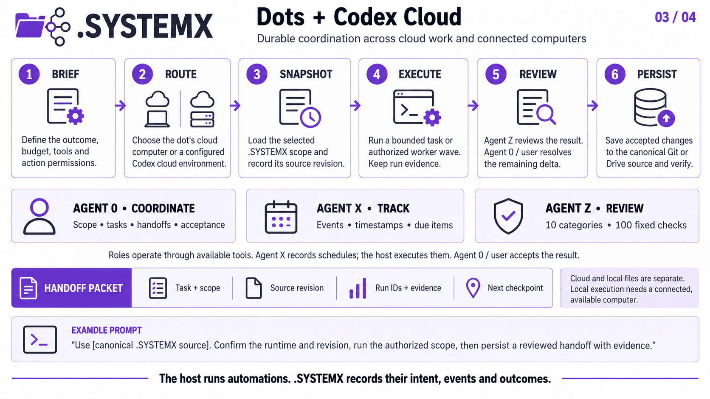

# Dots / Codex Cloud

[Gallery](README.md) · [Native PNG](dots-codex-cloud.png) · [4K JPEG](dots-codex-cloud-4k.jpg)

[](dots-codex-cloud-4k.jpg)

## Workflow

1. **Brief.** Define the outcome, budget, tools and action permissions.
2. **Route.** Choose the dot's cloud computer or a configured Codex cloud environment.
3. **Snapshot.** Load the selected .SYSTEMX scope and record its source revision.
4. **Execute.** Run a bounded task or authorized worker wave. Keep run evidence.
5. **Review.** Agent Z reviews the result. Agent 0 / user resolves the remaining delta.
6. **Persist.** Save accepted changes to the canonical Git or Drive source and verify.

## Agent responsibilities

- **Agent 0:** scope, tasks, handoffs and acceptance within user authority.
- **Agent X:** events, timestamps and due items; the host executes schedules.
- **Agent Z:** the fixed review policy with 10 categories and 100 questions.

These are roles implemented through the available toolchain. The public template
starts with Agent 0 only; [activate Agent X/Z](../docs/AGENT-X.md) explicitly in
the selected scope. A review score is advisory and does not approve external actions.

Treat the dot and its selected coding environment as distinct runtimes. Carry
the task ID, root or named child scope, source revision, actual run IDs, evidence,
and next checkpoint across handoffs. Persist accepted record changes to the
canonical Git/Drive source and verify them before ending or replacing a runtime.
A cloud task does not automatically see unsaved local files. Local execution
depends on the connected computer being available. Configure scheduling in the
host separately; Agent X records intended occurrences and observed outcomes.

## Copyable prompt

```text
Use [canonical .SYSTEMX source]. Confirm the runtime and revision, run the authorized scope, then persist a reviewed handoff with evidence.
```

## Platform reference

A dot can work on its cloud computer and route coding work to a configured Codex cloud environment. Its cloud and connected-computer access are separate. See [Computers and apps](https://learn.chatgpt.com/docs/dots/computers-and-apps).

Platform references checked 2026-10-04. Availability and permissions depend on
the account, host and configuration. The workflow is a .SYSTEMX usage pattern,
not a built-in integration or third-party endorsement.
