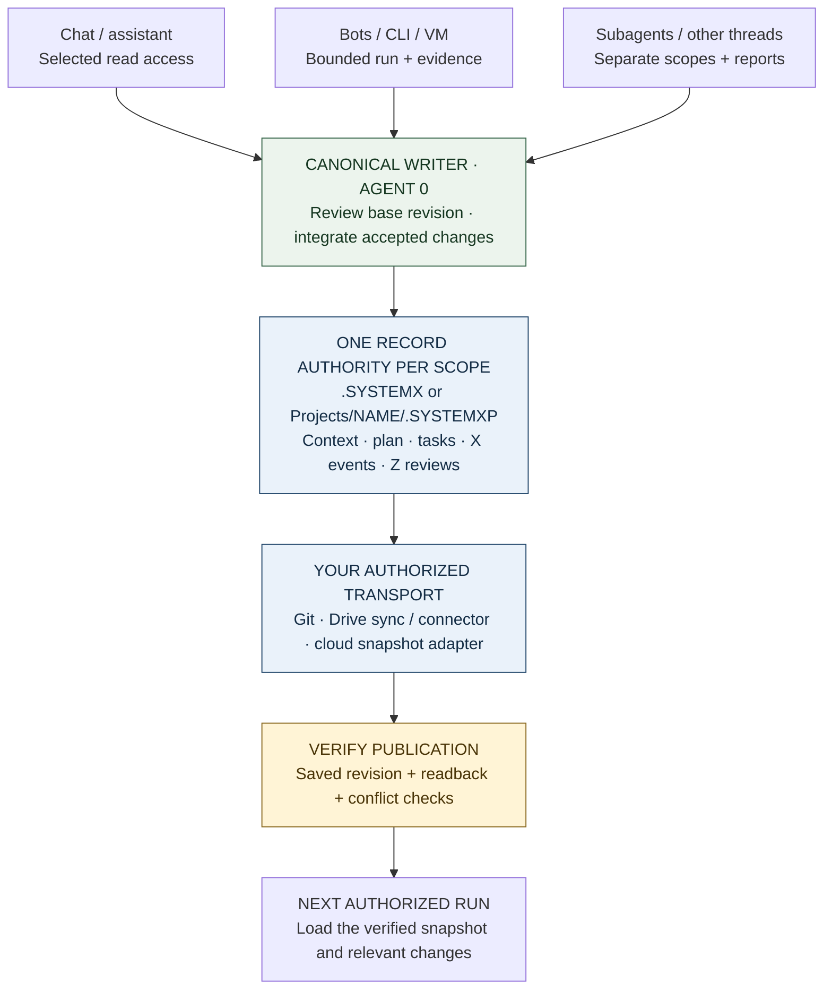

# Shared workspaces, clouds, chats, and bots



**Diagram:** Many readers and scoped workers share a verified snapshot; one owner reconciles canonical writes. Transport and access are supplied by the environment.

`.SYSTEMX` can serve as a shared **coordination point** for a repository, a local
working directory, a cloud-backed project, or several authorized chats and bots.
Its value is a common objective, current plan, canonical task state, evidence,
and a next action that another session can read. The format stores that state;
your storage, connector, harness, and permissions determine who can access it.

A URL is an address, not a grant of access or automatic memory. Verify readable
records, the selected project, the snapshot/revision, and write capability before
claiming a connection. A chat without writable tools returns a proposed handoff
for an owner to save. Use [First-time setup](FIRST-RUN.md) and the
[one-shot project guide](ONE-SHOT-PROJECT.md) for the full execution workflow.

## Choose a topology and one authority per record

| Pattern | Good fit | Canonical records |
| --- | --- | --- |
| One `.SYSTEMX` in each repository | Independent apps with separate histories and release policies | Each repository owns its work; cross-project coordination cites references |
| One portfolio `.SYSTEMX` with named `.SYSTEMXP` children | Several projects, channels, research topics, or operational areas | Outer records own portfolio coordination; each child owns its scoped work |
| A combination | A portfolio tracks outcomes while existing repos retain implementation records | Document which scope owns each kind of task; link accepted handoffs instead of duplicating mutable ledgers |

The supported multi-project path always includes a project name:

```text
Workspace/
└── .SYSTEMX/
    ├── GLOBAL/ · PLAN/ · WORK/ · AGENTS/    portfolio coordination
    ├── EVENTS/ · REVIEWS/                   after role activation
    └── Projects/
        ├── REGISTRY.json
        ├── WebApp/
        │   ├── .SYSTEMXP/                  app records
        │   └── code/                       optional local app code
        ├── Research/
        │   └── .SYSTEMXP/                  research records
        └── BotOps/
            └── .SYSTEMXP/                  operations records
```

**Use `.SYSTEMX/Projects/NAME/.SYSTEMXP`, not `.SYSTEMX/Projects/.SYSTEMXP`.**
Even one child needs its registered name. Never install a second `.SYSTEMX`
inside the outer one. `.SYSTEMXP` has scoped context, plan, tasks, focus, memory,
agent records, sources, decisions, and optional X/Z records; it uses the outer
installation's selected tools, defaults, version pin, and update policy.

A hybrid example: `Portfolio:WebApp` owns the launch milestone and external
handoff, while an existing application repo owns implementation tasks in its own
`.SYSTEMX`. The portfolio's source index identifies that repo, branch/commit,
record owner, and report location. A portfolio task may wait for its handoff,
but local `--depends-on` only references tasks in the same selected ledger.
Cross-scope prerequisites need explicit verification by the outer coordinator.
Do not make a second editable mirror of the app's full task ledger.

Create named scopes after installing the outer workspace:

```bash
bash .SYSTEMX/SYSTEMX.sh projects add WebApp --kind software
bash .SYSTEMX/SYSTEMX.sh projects add WebApp --kind software --apply
bash .SYSTEMX/SYSTEMX.sh projects add Research --kind research --apply
bash .SYSTEMX/SYSTEMX.sh projects add BotOps --kind operations --apply
bash .SYSTEMX/SYSTEMX.sh projects roles-init --project WebApp --apply
bash .SYSTEMX/SYSTEMX.sh projects context --project WebApp --agent agent.0
```

Preview each creation before applying it in real use. Existing destinations are
preserved or refused, never replaced. Qualified handoff labels such as
`WebApp:TASK-001` identify scope for people; CLI task IDs remain `TASK-001` with
`--project WebApp`. Commands run from `Projects/WebApp/`; references to an
external repository do not automatically redirect command execution.

## Separate record authority from transport

| Location | How records reach the worker | Required coordination |
| --- | --- | --- |
| Git repository | Authorized clone/checkout, selected commit, reviewed branch changes | One canonical integration owner; reconcile semantic ledger changes before publishing |
| Google Drive on a computer | Regular files made available locally through the sync client | One writing machine/session, completed sync, readback before ownership transfer |
| Drive through a connector/API | Authorized file listing, reads, and explicit writes | Check identity/scope/revision; use proposed patches if safe updates are unavailable |
| Cloud VM or real hardware | A named user-owned directory on durable storage | Explicit working directory, OS permissions, writer ownership, backups |
| Cloud object storage | An external adapter downloads/uploads versioned snapshots | Stale-write protection and a consistent snapshot protocol; a bucket is not a local directory |
| Chat without persistent file access | Reviewed attachments or a saved exported packet | Owner saves and reattaches changes; label unsaved output as a proposal |

The installer accepts an explicit **local containing directory**. Do not pass a
Drive URL, `gs://` bucket, HTTP URL, or cloud account as `--target`. The `drive`
profile describes local synchronized files; there is no shipped `cloud-sync`
command. Storage references belong in the scope's source index (child
`SOURCES.md`, or an explicit reference from root Global context).

Record the canonical location, project name, selected default version, current
revision/snapshot, coordinator/writer, read/write access, and last verification
time. Keep credentials in the environment's credential facilities, outside
project context and public exports.

## Give multiple chats the same project reference

A useful connection request includes more than the folder URL:

```text
Use this existing .SYSTEMX project; do not create a second installation.
Canonical location: [REPOSITORY / DRIVE FOLDER URL / LOCAL CONTAINING PATH].
Transport: [AUTHORIZED CONNECTOR / LOCAL CHECKOUT / ATTACHED SNAPSHOT].
Scope: [ROOT or REGISTERED CHILD NAME]; expected snapshot/revision: [VALUE].
Canonical writer/coordinator: [OWNER / CHAT]. Your assigned task: [SCOPED ID].
Access for this chat: [READ ONLY / PROPOSE CHANGES / APPROVED WRITE SCOPE].

Verify actual access and exact .SYSTEMX/.SYSTEMXP casing. Load START-HERE,
current focus, relevant Global/Master Plan context, task acceptance, and selected
agent memory from the intended scope. Recheck changed facts. If the reference
is inaccessible or stale, report that and use the supplied handoff; do not claim
that a URL alone connected memory. Preserve canonical IDs and original evidence.
Return findings and proposed updates to the owner unless this chat owns the
serialized write. Report persistence only after successful write and readback.
```

One chat may research, another implement, and another review. Each receives a
bounded task packet and returns a uniquely identified report with its base
revision. Agent 0 integrates accepted facts, task changes, X events, and Z
scorecards. All roles can run sequentially in one assistant when parallelism is
unavailable. A thread title, agent ID, or folder name is not an access credential.

## Google Drive: local synchronization and connector access

For a locally available project folder, install once with the `drive` profile:

```bash
systemx first-run --target "/your/local/Drive/Portfolio" --profile drive
systemx first-run --target "/your/local/Drive/Portfolio" --profile drive --apply
systemx run --target "/your/local/Drive/Portfolio" --offline -- projects list
```

Choose the actual mounted/mirrored path. A Windows example might be
`G:\My Drive\Portfolio`, but the drive letter is machine-specific. Make files
available locally before running commands; preserve ordinary Markdown/JSON files
and their directory hierarchy. Follow Google's [streaming and mirroring guide](https://support.google.com/drive/answer/13401938).

A chat with a Drive connector may read a folder URL only when the connected
account and tool support those files. Verify access by reading the selected
records, not just displaying the folder title. Google Drive's API distinguishes
file downloads from export of native Workspace documents and requires download
capability checks. Keep canonical `.SYSTEMX` Markdown/JSON as regular files to
avoid format conversions. [Google Drive download/export documentation](https://developers.google.com/workspace/drive/api/guides/manage-downloads).

Use a single writer. At handoff, finish writes, wait for sync, inspect conflict
copies, and verify the expected revision/content on the receiving machine before
it writes. A local lock file does not serialize other machines. Do not resolve
conflicts by deleting a whole directory, keeping whichever copy is newest by
clock alone, or merging two task histories without review. Keep the previous
snapshot available for recovery. See [Google Drive setup](https://github.com/WayneTechLab/dotSYSTEMX/wiki/Setup-Google-Drive).

## Google Cloud and other clouds

On a VM, install into a normal named working directory such as
`/srv/project-workspace` after its owner has provided the directory and access.
On a container or ephemeral worker, mount a reviewed persistent volume or restore
an approved snapshot before work, and verify persistence before shutdown. A folder
on an ephemeral disk does not survive merely because it is named `.SYSTEMX`.
Cloud provider choice does not change the file format.

For object storage, use an explicitly implemented adapter or a reviewed manual
transfer. A reliable adapter design is:

1. Fetch an identified snapshot and its manifest into a contained local staging
   directory. Verify paths, hashes, expected scope, and supported defaults.
2. Give workers bounded read-only context and collect changes against that base.
   One authorized owner validates and applies canonical record updates.
3. Upload a new immutable snapshot, then conditionally advance a small current
   pointer only if its previous generation/version still matches the read base.
4. If the comparison fails, stop the write, fetch current state, and reconcile.
   Read the selected snapshot back before reporting it published.

These are **adapter requirements**, not commands or services installed by
`.SYSTEMX`. A multi-file directory needs a consistent snapshot boundary; separate
successful uploads do not create an atomic directory transaction. Google Cloud
Storage offers generation preconditions for detecting unexpected object changes;
a failed precondition rejects the operation. [Cloud Storage preconditions](https://docs.cloud.google.com/storage/docs/request-preconditions).
Use the chosen provider's documented equivalent where available and test its
semantics. Without safe conditional publication, serialize ownership externally
and retain snapshots. Do not infer cloud synchronization from a source URL.

## Bots, Codex sessions/dots, and Grok-based workers

A bot needs four things: an authorized trigger, a runtime/toolchain, access to
selected persistent records, and a stop condition. `.SYSTEMX` provides the record
format and local CLI; the bot host supplies the rest. A physical computer and a
VM use the same pattern. Scheduled work must be configured and removed in its
actual scheduler; an Agent X due item does not create or cancel that job.

For Codex-based sessions, local CLI tasks, or a workspace you call a “Codex dot,”
select the accessible project and have each run load the current records before
acting. Feature availability and execution location depend on the actual client.
OpenAI documents [subagents](https://developers.openai.com/codex/multi-agent/) and
[scheduled tasks](https://developers.openai.com/codex/app/automations/); neither
creates a built-in `.SYSTEMX` connector. Use only supported, authorized tools and
record the actual runtime job ID in the handoff.

A Grok-based bot can expose narrow file/CLI operations through its own tool
adapter. In xAI's function-calling flow, the model requests a custom tool call,
the application executes it, and returns the result. Your application must enforce
paths, permissions, limits, and write ownership. [xAI function calling](https://docs.x.ai/developers/tools/function-calling).
A consumer chat's access may differ from an API bot; verify capabilities instead
of assuming the model can read a local folder or Drive URL.

A bot startup can use the installed library's bounded read operations:

```python
from systemx import run

workspace = "/path/to/approved/workspace"  # Fixed by the authorized host.
result = run(workspace, ["context", "--agent", "agent.0"],
             offline=True, capture=True)
result.check_returncode()
context_packet = result.stdout  # Supply only relevant, authorized context.
```

For a child use `projects(workspace, ["context", "--project", "BotOps",
"--agent", "agent.0"])`. A scoped worker can load its own registered numeric
agent instead. An adapter should allowlist operations and resolve a fixed approved
workspace; it should not turn untrusted model text into an arbitrary shell command.
Reading a packet does not launch a model, make a memory update, or validate live state.

An execution prompt for an **already authorized bot run**:

```text
Use [WORKSPACE + SCOPE] and [EXISTING TASK ID]. Load the current .SYSTEMX records
and verify the expected base revision. Follow the accepted objective, permissions,
writer ownership, time/cost budget, and next action. Do not start another copy of
an active job; reconcile its real job handle first. Perform only this bounded run.
Record meaningful Agent X events with the external job/attempt identity and actual
times. Return evidence and proposed task updates to Agent 0, or apply them only
when this run owns canonical writes. Use Agent Z at the agreed review boundary;
reuse unchanged reports. Save a checkpoint and stop at the task's acceptance,
budget, blocker, or handoff boundary. Do not silently create recurring schedules.
```

“Instant memory” means a newly started process can load saved context immediately
when it has access; it does not mean automatic model recall, zero token cost, or
that every tool reads the folder without instruction. Each run should leave a
verified checkpoint for the next run. Test a bot manually before scheduling it,
and record how to disable the trigger and remove any extra resources it installs.

## Safe convergence across multiple sessions

Use **many readers/workers and one canonical writer per scope**. Separate write
scopes may proceed in parallel; shared ledgers, routing, schemas, installations,
and delivery targets need an explicit owner. A worktree's copied `.SYSTEMX` is
not an automatically synchronized canonical memory service. Avoid independently
allocating task IDs in divergent copies and then blindly merging them.

A handoff should include scope, task ID, base revision, actor/run ID, observed
time, changed files, original evidence, proposed record changes, and next action.
The owner checks whether the base is still current, integrates accepted work,
records time/review results, regenerates views, validates, and publishes the next
revision through the chosen transport. Readers acknowledge the actual new version.
For offline chats, clearly label results as pending integration until this happens.

The durable knowledge can improve over successive turns because evidence,
corrections, and accepted decisions accumulate. Maintain one original source for
each fact, refresh stale observations, and avoid copying whole sibling histories.
See [Planning and memory](https://github.com/WayneTechLab/dotSYSTEMX/wiki/Planning-and-Memory), [Agent X](AGENT-X.md), [Agent Z](AGENT-Z.md),
and [the Visual Guide](https://github.com/WayneTechLab/dotSYSTEMX/wiki/Visual-Guide) for the shared-context feedback model.

## Recovery, privacy, and removal

Inspect incomplete operations and actual worker state before retrying. Stop
writers before install/update/removal or changing sync ownership. Never treat a
network timeout as proof that a remote write failed. Retain the previous snapshot
and reconcile uncertain publication before retrying with a new identity.

Share only the intended project records with the intended audience. Hidden names
are not access controls. A populated private workspace must not be republished as
the blank public template. Updates preserve user files and policies; the standard
uninstall archives the entire local `.SYSTEMX`, including child code stored under
`Projects`. It does not delete cloud snapshots, revoke OAuth, stop external bots,
or uninstall schedulers. Record and remove those separately through the tools
that created them, with receipts. [Uninstall and cleanup](UNINSTALL.md).
