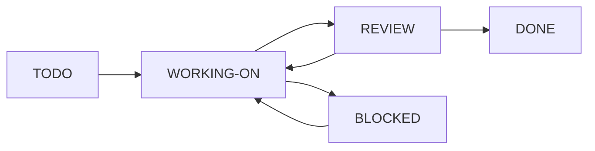

# dotSYSTEMX

**A portable operating standard for human and AI-assisted projects.**

dotSYSTEMX brings project context, master planning, task tracking, agent
coordination, and durable memory into one versioned `.SYSTEMX` folder. It gives
people and LLMs a clear place to understand the project, choose the next task,
record evidence, and resume work across sessions.

Use it alongside your existing language, framework, editor, and infrastructure.
The documentation stands on its own; the optional command tools use Python's
standard library and require no package installation.

[Use this template](https://github.com/WayneTechLab/dotSYSTEMX/generate) ·
[Getting started](https://github.com/WayneTechLab/dotSYSTEMX/wiki/Getting-Started) ·
[Documentation](https://github.com/WayneTechLab/dotSYSTEMX/wiki) ·
[Command reference](https://github.com/WayneTechLab/dotSYSTEMX/wiki/Command-Reference) ·
[MIT license](.SYSTEMX/LICENSE)

The [format contract](.SYSTEMX/FORMAT.md) defines the canonical records, task
lifecycle, versioning, and public distribution requirements. SYSTEMX is a
reusable project convention; it is not a certification of an adopted project.

## What you get

| Capability | What it provides |
| --- | --- |
| Shared project context | Purpose, constraints, terminology, and authoritative references for everyone working on the project. |
| Master planning | Outcomes, milestones, dependencies, and acceptance criteria connected to concrete tasks. |
| Work tracking | One task ledger with generated TODO, WORKING-ON, BLOCKED, REVIEW, DONE, and CANCELLED views. |
| Current focus | A compact objective and task/checkpoint pointers, with a generated current view. |
| Agent 0 coordination | A coordinator role for assignments, integration, acceptance review, and shared-memory updates. |
| Scoped agent memory | Separate worker notes, verified project facts, and session checkpoints for reliable handoffs. |
| Project commands | Explicit configuration for checks, development, builds, and deployments. |
| Operating guidance | Reusable standards for development, accessibility, security, quality, and operations. |

Projects start with blank records and a single `agent.0` role. You supply the
project requirements, tools, commands, and evidence.

## Quick start

### Start a new repository

Select **[Use this template](https://github.com/WayneTechLab/dotSYSTEMX/generate)**
to create your own repository, then clone it. From its root, run:

```bash
bash .SYSTEMX/SYSTEMX.sh validate
bash .SYSTEMX/SYSTEMX.sh doctor
bash .SYSTEMX/SYSTEMX.sh status
bash .SYSTEMX/SYSTEMX.sh context --agent agent.0
```

These commands inspect the template and load its context. To configure your
project's own commands:

```bash
bash .SYSTEMX/SYSTEMX.sh init
```

Edit the newly created `.SYSTEMX/project.json`, fill in
[global context](.SYSTEMX/GLOBAL/CONTEXT.md), and define the
[master plan](.SYSTEMX/PLAN/MASTER-PLAN.md). Follow the
[setup guide](https://github.com/WayneTechLab/dotSYSTEMX/wiki/Getting-Started)
for the complete adoption workflow. Existing configuration is never overwritten
by `init`.

### Add it to an existing project

Copy the complete `.SYSTEMX` folder into your repository, including its license.
If the project already has `.SYSTEMX`, compare and merge deliberately so local
configuration, tasks, decisions, and memory are preserved. The root README and
GitHub wiki are documentation for this distribution; the operating folder is
self-contained.

### Requirements

- **Documentation:** any Markdown reader or coding assistant with file access.
- **Command tools:** Python **3.9+**; no third-party Python packages.
- **Bash launchers:** macOS, Linux, WSL, or Git Bash.
- **Windows alternative:** `py -3 .SYSTEMX/scripts/systemx.py validate`.
- **Project tools:** whichever runtimes and commands your project configures.

## How the project stays organized

```text
.SYSTEMX/
├── START-HERE.md          LLM and operator load order
├── CURRENT.md             Generated current objective and task pointers
├── STANDARD.md            Shared operating contract
├── GLOBAL/                Project-wide context and constraints
├── PLAN/                  Master plan and milestones
├── WORK/                  Canonical tasks and generated status views
├── MEMORY/                Verified facts and session checkpoints
├── AGENTS/                Agent 0, worker registry, and individual memory
├── AI/                    Collaboration and tool-use guidance
├── config/                Empty project configuration example
├── docs/                  Engineering and operations standards
├── templates/             Briefs, decisions, releases, and handoffs
├── scripts/               Command runner and validation tools
└── tests/                 Isolated regression checks
```

**Start or resume at [.SYSTEMX/START-HERE.md](.SYSTEMX/START-HERE.md).** The load
order starts with the current focus, then shared context, master plan, project memory, current
tasks, and the selected agent's notes. Volatile facts still need to be rechecked
against the working tree and actual runtime.

“Global” means shared across agents in the active project. Cross-project or
organization-wide standards can be referenced explicitly; project memories are
not automatically synchronized.

## A clear path from task to acceptance



The diagram shows the common workflow. The
[task guide](https://github.com/WayneTechLab/dotSYSTEMX/wiki/Task-Workflow)
covers the full transition rules, cancellation, dependencies, and reopening.
`done` requires recorded acceptance evidence and review by `agent.0` or the
project owner. Earlier completion evidence stays in history when work reopens.

Agent 0 can perform the work itself or coordinate approved subagents. Registering
an agent creates a role and memory file; your chosen agent environment starts
and runs the worker. The template does not install an agent runtime.

## Everyday commands

```bash
# Open the menu
bash .SYSTEMX/SYSTEMX.sh

# Inspect work and reload project context
bash .SYSTEMX/SYSTEMX.sh status
bash .SYSTEMX/SYSTEMX.sh context --agent agent.0
bash .SYSTEMX/SYSTEMX.sh task-ready

# Run configured project checks
bash .SYSTEMX/SYSTEMX.sh check

# Inspect a configured release plan without executing project commands
bash .SYSTEMX/SYSTEMX.sh deploy --dry-run
```

`check`, `build`, and `deploy` require configured project checks. Missing commands
produce an error instead of a false success. Commands run from the containing
project root, and a failed step stops the sequence. See
[configuration and quality](https://github.com/WayneTechLab/dotSYSTEMX/wiki/Configuration-and-Quality).

In an adopted project with existing tasks, select the objective with `focus` and
prepare an assignment with `task-packet`. These commands preserve the canonical
ledger and do not start workers. See the [work commands](.SYSTEMX/WORK/README.md).
The [evidence guide](.SYSTEMX/docs/EVIDENCE.md) explains how to preserve source
credit while keeping runtime or release acceptance open. Use the
[upgrade guide](.SYSTEMX/docs/UPGRADING.md) before merging this folder into an
active project with existing records.

## Documentation

| Guide | Read it when you want to… |
| --- | --- |
| [Standard format](https://github.com/WayneTechLab/dotSYSTEMX/wiki/Standard-Format) | Understand canonical records, versioning, and a clean public distribution. |
| [Getting started](https://github.com/WayneTechLab/dotSYSTEMX/wiki/Getting-Started) | Adopt the template in a new or existing project. |
| [Agent 0 and subagents](https://github.com/WayneTechLab/dotSYSTEMX/wiki/Agent-0-and-Subagents) | Assign work, scope workers, and review results. |
| [Planning and memory](https://github.com/WayneTechLab/dotSYSTEMX/wiki/Planning-and-Memory) | Structure a master plan and preserve useful context. |
| [Task workflow](https://github.com/WayneTechLab/dotSYSTEMX/wiki/Task-Workflow) | Create tasks, manage dependencies, and record acceptance. |
| [Command reference](https://github.com/WayneTechLab/dotSYSTEMX/wiki/Command-Reference) | Find command syntax, flags, and expected behavior. |
| [Configuration and quality](https://github.com/WayneTechLab/dotSYSTEMX/wiki/Configuration-and-Quality) | Connect your stack and define meaningful checks. |
| [Operations and troubleshooting](https://github.com/WayneTechLab/dotSYSTEMX/wiki/Operations-and-Troubleshooting) | Handle releases, recovery, locks, and common setup problems. |
| [Evidence and acceptance](https://github.com/WayneTechLab/dotSYSTEMX/wiki/Evidence-and-Acceptance) | Separate source, artifact, functional, operational, and publication claims. |
| [Upgrading](https://github.com/WayneTechLab/dotSYSTEMX/wiki/Upgrading) | Preserve project records when merging a new template version. |
| [Contributing](https://github.com/WayneTechLab/dotSYSTEMX/wiki/Contributing) | Propose improvements while keeping the template reusable. |

## Verification and boundaries

To validate this template and run its isolated regression suite:

```bash
bash .SYSTEMX/SYSTEMX.sh validate
# On a pristine distribution, before recording project work:
bash .SYSTEMX/SYSTEMX.sh validate --template
python3 -B -m unittest discover -s .SYSTEMX/tests -v
```

Template validation checks structure, configuration, local file links, task
records, dependencies, and generated-view consistency. Project quality comes
from the checks you configure. Recorded evidence and reviewer names are project
records, not independent authentication or proof that a test ran.
The additional `--template` check requires blank project records and the
explicit distribution file inventory. It rejects initialized configuration,
extra workers, custom files, and private runtime artifacts, including ignored
files inside the folder. It is intended for template publication, not active
project validation. Maintainers also review the actual exported archive.

Review commands before executing them. Keep secrets out of configuration,
memory, and Git history, and exclude `.SYSTEMX` from public application build
artifacts. The command runner does not provision services or automatically
commit, push, install hooks, or authorize production changes.

## Project and license

Maintained by **[Wayne Tech Lab LLC](https://github.com/WayneTechLab)**.

dotSYSTEMX is an independent, curated derivative of the operating folder in
[SFWA-WTL-TEMPLATE](https://github.com/WayneTechLab/SFWA-WTL-TEMPLATE). The exact
source revision and extraction scope are recorded in
[SOURCE.json](.SYSTEMX/SOURCE.json). Template history is recorded in the
[changelog](.SYSTEMX/CHANGELOG.md).

Released under the [MIT License](.SYSTEMX/LICENSE). Retain the license notice
when copying or redistributing the template.
