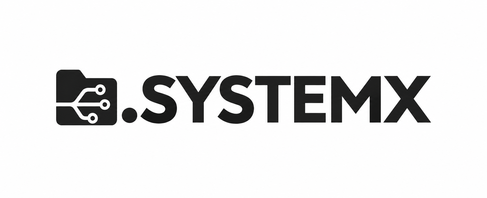
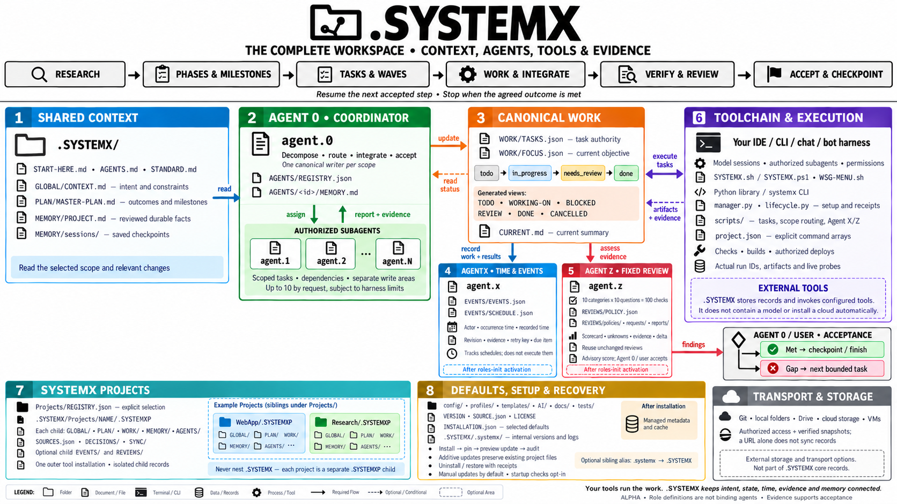
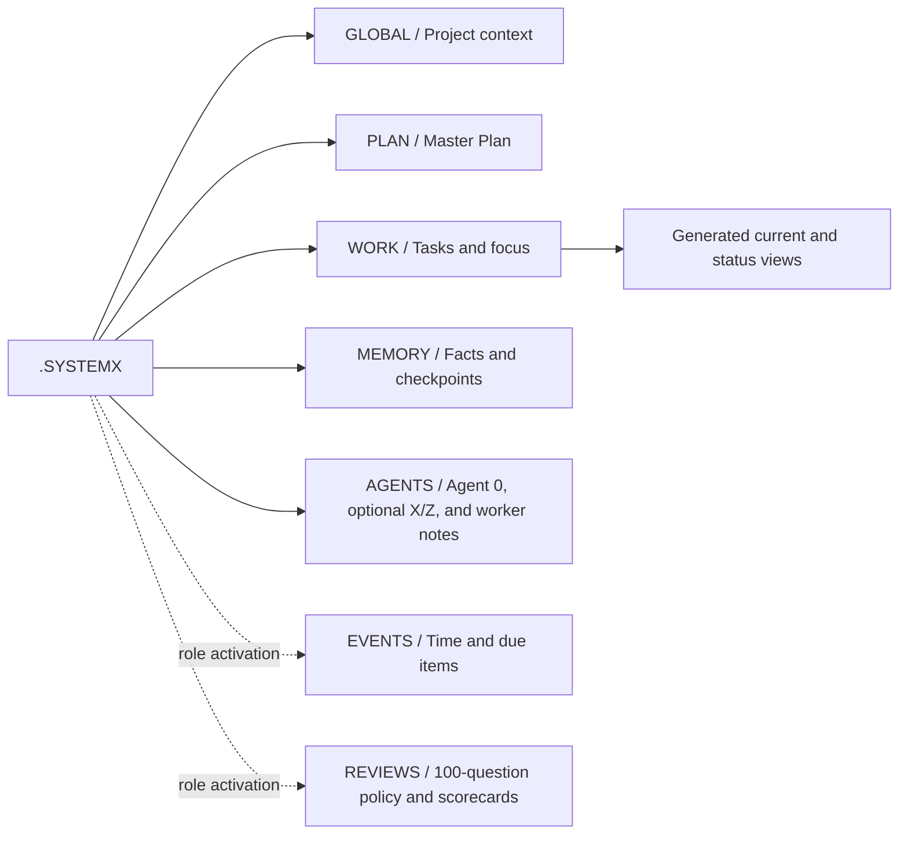
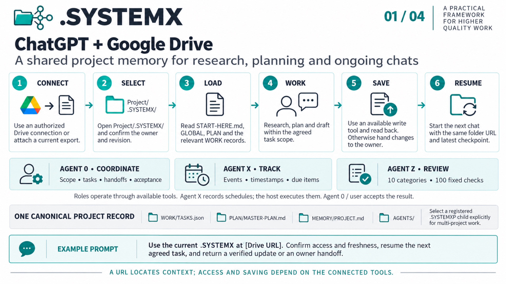
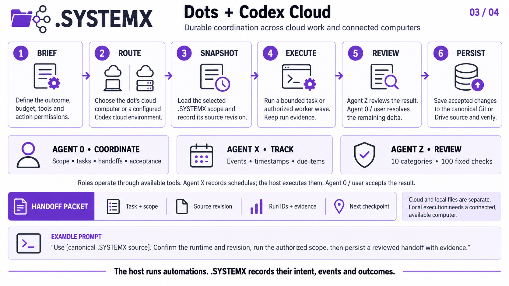

# .SYSTEMX



**DOT SYSTEMX — project memory and coordination for agentic coding.**

A product of **Wayne Tech Lab LLC**. Created by **Lucas (SatoshiUNO)**.
[Portfolio: Networks.Chat](https://Networks.Chat) ·
[Business: WayneTechLab.com](https://WayneTechLab.com)

Keep the objective, plan, tasks, evidence, and next step in one portable folder.
`.SYSTEMX` helps people and AI assistants continue a project across sessions,
tools, and agents without repeatedly reconstructing what happened or drifting
away from what was agreed.

[Read the manual](https://github.com/WayneTechLab/dotSYSTEMX/wiki) ·
[Read the illustrated research paper](https://github.com/WayneTechLab/dotSYSTEMX/wiki/White-Paper) ·
[First-time setup](https://github.com/WayneTechLab/dotSYSTEMX/wiki/First-Time-Setup) ·
[Copy a setup prompt](https://github.com/WayneTechLab/dotSYSTEMX/wiki/New-Chat-Setup-Prompt) ·
[Use this template](https://github.com/WayneTechLab/dotSYSTEMX/generate)

The [illustrated research paper](https://github.com/WayneTechLab/dotSYSTEMX/wiki/White-Paper)
brings the complete implementation reference together with MLA-style citations,
Agent 0/X/Z coordination diagrams and four workflow infographics. Its PDF has
clickable contents, figures, references and public project links.

> **ALPHA — USE AT YOUR OWN RISK.** `.SYSTEMX` is experimental and may change daily.
> Pin a reviewed release, keep recoverable backups, and validate it in your project.
> It is provided without warranty; template checks do not establish production readiness.
> See the [release policy](https://github.com/WayneTechLab/dotSYSTEMX/wiki/Release-Policy)
> and [versions and changelog](https://github.com/WayneTechLab/dotSYSTEMX/wiki/Versions-and-Changelog).

## Why I started .SYSTEMX

I started `.SYSTEMX` to keep my local scripts and TODO folder in sync while
working on a project. I needed a reliable place to record what needed doing,
what was being worked on, and what was actually finished.

Over the last year, that working folder has evolved into a reusable operating
standard for agentic coding: project context, a Master Plan, task ownership,
Agent 0 coordination, evidence, and memory that can survive a new chat. It grew
within my larger Firebase and Google Cloud template. This standalone version
makes the same approach available to projects using other stacks, and to work
that does not involve code at all.

The goal is to help an AI stay with the original objective while a process,
idea, or application moves through thousands of changes. **Continuity across
10,000 or more task-based events is the design ambition.** That means keeping
useful state across assignments, checks, reviews, and handoffs; it is not a
claim of benchmarked throughput or guaranteed autonomous completion.

The [About page](https://github.com/WayneTechLab/dotSYSTEMX/wiki/About) tells the
founder's story. The [long-running work guide](https://github.com/WayneTechLab/dotSYSTEMX/wiki/Anti-Drift-and-Long-Running-Work)
explains how to organize that ambition into manageable, reviewable work.

## Why “DOT SYSTEMX”?

The name comes directly from **`.SYSTEMX`**. The leading period is the “dot”:
on macOS and Linux, names beginning with a dot are conventionally hidden from
ordinary file listings. Windows uses a separate hidden attribute. A hidden
folder is still ordinary project data; the name does not make it private,
encrypted, or excluded from Git.

**Always use the exact spelling `.SYSTEMX`, including the dot and uppercase
letters.** On a case-sensitive filesystem, `.systemx` can become a second,
conflicting folder. Setup offers an optional compatibility link that routes
lowercase access to the same canonical folder where supported.
[Naming and alias instructions](https://github.com/WayneTechLab/dotSYSTEMX/wiki/Exact-Case-and-Alias).

## How it works

[](docs/assets/systemx-full-system-4k.png)

[Download the 4K PNG (upscaled)](docs/assets/systemx-full-system-4k.png) ·
[Native PNG](docs/assets/systemx-full-system.png) ·
[Read its text equivalent](docs/assets/systemx-full-system.md) ·
[Explore the visual manual](https://github.com/WayneTechLab/dotSYSTEMX/wiki/Visual-Guide#full-system-overview)

1. **Define the outcome.** Save the project's purpose, constraints, and acceptance criteria.
2. **Plan the next work.** Agent 0 connects milestones to tasks with owners and dependencies.
3. **Work within scope.** One agent handles the task, or authorized subagents take independent assignments.
4. **Record time and evidence.** Agent X preserves meaningful events, attempts, revisions, and due items.
5. **Verify and review.** Agent Z applies the fixed 100-question policy at a review boundary; Agent 0/user accepts against the original criteria.
6. **Save the next step or finish.** Update canonical tasks, generated views, reviewed memory, and the checkpoint. Reuse unchanged proof instead of starting another processing loop.

| Responsibility | Record inside `.SYSTEMX` |
| --- | --- |
| Shared project context and constraints | `GLOBAL/CONTEXT.md` |
| Outcomes, milestones, and acceptance criteria | `PLAN/MASTER-PLAN.md` |
| Task ownership, status, dependencies, and evidence | `WORK/TASKS.json` |
| Current objective and task pointers | `WORK/FOCUS.json` → generated `CURRENT.md` |
| Verified decisions and reusable knowledge | `MEMORY/PROJECT.md` |
| Coordinator and worker continuity | `AGENTS/<id>/MEMORY.md` and dated session checkpoints |
| Event/time and due-item records after activation | `EVENTS/EVENTS.json` and `EVENTS/SCHEDULE.json` |
| Versioned policy and fixed review scorecards after activation | `REVIEWS/POLICY.json`, requests, policy snapshots, and reports |

The ledger generates TODO, WORKING-ON, BLOCKED, REVIEW, DONE, and CANCELLED views.
“Global” means shared within the active project. The public template starts
blank, with only the `agent.0` coordinator role.

<details>
<summary>View the .SYSTEMX record tree</summary>



This is a map of responsibilities, not a complete directory listing. See the
[Visual Guide](https://github.com/WayneTechLab/dotSYSTEMX/wiki/Visual-Guide)
for the record flow, managed defaults, and accessible text explanations.

</details>

Follow [a first task from start to finish](https://github.com/WayneTechLab/dotSYSTEMX/wiki/Daily-Workflow)
or read the [planning and memory guide](https://github.com/WayneTechLab/dotSYSTEMX/wiki/Planning-and-Memory).

## Choose your working environment

Four separate use-case cards show how to carry the same `.SYSTEMX` records through
chat, Git, cloud work and a local terminal. Open a card for its 4K download.

| ChatGPT + Google Drive | Codex + GitHub / main project |
| --- | --- |
| [](.SYSTEMX/MEDIA/Infographics/chatgpt-google-drive-4k.jpg) | [](.SYSTEMX/MEDIA/Infographics/codex-github-main-4k.jpg) |
| Dots / Codex Cloud | Codex / Copilot CLI + local drive |
| [](.SYSTEMX/MEDIA/Infographics/dots-codex-cloud-4k.jpg) | [](.SYSTEMX/MEDIA/Infographics/codex-copilot-cli-local-4k.jpg) |

[Open the wiki walkthroughs](https://github.com/WayneTechLab/dotSYSTEMX/wiki/Use-Case-Infographics) ·
[Media library, 4K downloads and text guides](.SYSTEMX/MEDIA/README.md).
The 4K files are resized JPEG exports; native PNG masters are retained.

## From one researched brief to a finished project

Start with a deep-research brief: the problem, audience, relevant sources,
constraints, examples, and measurable acceptance criteria. More verified,
relevant information can improve results; a larger unfiltered prompt can also
increase noise and cost. Save sources once and give each task the context it needs.

A comprehensive “one shot” request can become **phases → milestones → tasks →
execution waves**, with authorized subagents or threads handling independent
scopes. Agent 0 keeps the Global context and Master Plan connected to each turn;
Agent X records what happened and when; Agent Z reviews evidence and the remaining
delta. Canonical task updates keep TODO, WORKING-ON, REVIEW, and DONE views coherent.

This can feel like a shared project brain: verified knowledge and corrections
accumulate across sessions. It is a coordination and memory pattern, not AGI or
model retraining, and improvement still depends on the quality of evidence and
review. “One shot” describes the starting brief, not a guarantee of completion
in one response or unlimited unattended execution.

Follow the [20-page web app, start-to-finish guide](https://github.com/WayneTechLab/dotSYSTEMX/wiki/One-Shot-Project-Guide)
for a route inventory, toolchain map, research and execution super prompts,
wave gates, and completion evidence. The same process supports research reports,
CLI tools, bots, content sites, and migrations.

## SYSTEMX PROJECTS: one workspace, separate project memory

Track multiple projects or channels with **`.SYSTEMXP`**, the child record format
for **SYSTEMX PROJECTS**. One outer `.SYSTEMX` supplies shared tools and standards;
each project keeps its own context, Master Plan, tasks, status, decisions, and
Agent 0/subagent memory.

```text
.SYSTEMX/
├── GLOBAL/ · PLAN/ · WORK/ · AGENTS/   workspace coordination
└── Projects/
    ├── REGISTRY.json                  explicit project selection
    ├── Project-A/
    │   └── .SYSTEMXP/                 Project A's records
    └── Project-B/
        └── .SYSTEMXP/                 Project B's records
```

Use exactly **`.SYSTEMX/Projects/Project-A/.SYSTEMXP`**. Never create a nested
`.SYSTEMX` or an independent lowercase marker. The public template's registry
is empty; these names are examples. Code can live beside each child's records,
or you can track explicit references to repositories, Drive folders, and chats.

After setting up the outer folder, run from its workspace root:

```bash
bash .SYSTEMX/SYSTEMX.sh projects add Project-A --kind software   # preview
bash .SYSTEMX/SYSTEMX.sh projects add Project-A --kind software --apply
bash .SYSTEMX/SYSTEMX.sh projects add Project-B --kind channel --apply
bash .SYSTEMX/SYSTEMX.sh projects context --project Project-A --agent agent.0
```

Every scoped work command requires an explicit project or root selection.
Updates preserve existing child records and working files. This is local record
routing; source references do not automatically connect services or launch agents.
Read the [SYSTEMX PROJECTS manual](https://github.com/WayneTechLab/dotSYSTEMX/wiki/SYSTEMX-Projects)
for first-time setup, scoped task commands, subagent handoffs, status snapshots,
chat export, version ownership, and removal.

## Shared context across repositories, clouds, chats, and bots

Use one `.SYSTEMX` per repository, one portfolio with named `.SYSTEMXP` children,
or a combination with explicit ownership and handoff references. Several chats
can work from the same project snapshot when their tools have authorized access.
A Drive folder URL identifies the source; the connector or local sync client
provides access and persistence. Keep one canonical writer per scope and verify
saved revisions before another session writes.

A bot on a computer, VM, or cloud worker can load the same project records at
startup through its CLI or adapter. This supplies immediately available context
when access exists; the harness still owns execution, scheduling, and permissions.
Read [shared workspaces, clouds, chats, and bots](https://github.com/WayneTechLab/dotSYSTEMX/wiki/Shared-Workspaces-Cloud-and-Bots)
for Drive, cloud snapshot patterns, Codex sessions/dots, Grok-based workers,
concurrent-chat handoffs, recovery, and removal boundaries.

## Agent 0 and your AI tools

Agent 0 keeps the overall objective, assignments, review, and shared memory
coherent. Subagents receive bounded tasks and return findings, changes, and
evidence. Your **AI harness**—the app, CLI, or IDE integration running the
assistant—provides the actual agent processes and tools. `.SYSTEMX` provides
the coordination rules and persistent project records.

The standard also defines **Agent X** for events and time, and **Agent Z** for
repeatable peer review:

| Role | Responsibility |
| --- | --- |
| **Agent 0** | Plans work, routes subagents, integrates results, and accepts tasks |
| **Agent X** | Records human/bot/automation events, due items, observations, and original timestamps |
| **Agent Z** | Reviews the same 100 questions across 10 categories and reports an evidence-backed scorecard and delta |

Activate their project records with `roles-init` to preview, then `roles-init --apply`.
For a child, use `projects roles-init --project Project-A --apply`. Existing records
are preserved; registration never launches workers or schedules jobs.

Agent Z can review an initial prompt, a task ready for completion, a change, or a
whole project. It retains the question set, source/evidence versions, unknowns,
and original scorecards. Unchanged inputs reuse the saved review. A score does
not automatically reopen work, rerun tests, approve deployment, or replace Agent
0's acceptance decision. Project owners can customize a versioned local policy.
Read the [Agent X guide](https://github.com/WayneTechLab/dotSYSTEMX/wiki/Agent-X),
[Agent Z guide](https://github.com/WayneTechLab/dotSYSTEMX/wiki/Agent-Z), and
[100-question rubric](https://github.com/WayneTechLab/dotSYSTEMX/wiki/Agent-Z-Questions).

Once the project is set up, a short request can be:

```text
Finish [TASK OR OBJECTIVE] using .SYSTEMX Agent 0 with subagents.
Use up to 10 subagents by default for this request, subject to the
harness's available capacity. Use fewer when the work does not benefit
from parallelism. Agent 0 owns coordination, integration, and final review.
```

In a Codex environment with subagent support, the assistant can use Codex's
delegation tools and show worker activity in the client. Each worker's scope,
results, and handoff can be recorded under `.SYSTEMX`, with Agent 0 reviewing
what becomes shared project memory. See the
[complete Agent 0 workflow](https://github.com/WayneTechLab/dotSYSTEMX/wiki/Agent-0-and-Subagents)
and [copyable task prompts](https://github.com/WayneTechLab/dotSYSTEMX/wiki/Prompt-Cookbook).

Here, **10 is a requested ceiling for subagents, in addition to Agent 0**;
lower environment limits still apply. The template does not enforce a worker
count or start agents when a folder is opened. Its normal workflow uses one
worker unless delegation is authorized. Recording a role is separate from
launching and observing an actual worker.

The [subagent processing guide](https://github.com/WayneTechLab/dotSYSTEMX/wiki/Subagent-Processing)
shows the full assignment-to-review sequence. The
[advanced use cases](https://github.com/WayneTechLab/dotSYSTEMX/wiki/Advanced-Use-Cases)
show how to apply it to features, investigations, research, shared folders,
chat handoffs, and coordinated work across projects.

## Start with your project

| Workspace | Setup guide |
| --- | --- |
| A researched brief through a complete app or other deliverable | [One-shot project guide](https://github.com/WayneTechLab/dotSYSTEMX/wiki/One-Shot-Project-Guide) |
| Shared work across chats, repositories, clouds, or bots | [Shared workspace guide](https://github.com/WayneTechLab/dotSYSTEMX/wiki/Shared-Workspaces-Cloud-and-Bots) |
| Multiple projects or channels in one workspace | [SYSTEMX PROJECTS](https://github.com/WayneTechLab/dotSYSTEMX/wiki/SYSTEMX-Projects) |
| Repository or VS Code project root | [Project setup](https://github.com/WayneTechLab/dotSYSTEMX/wiki/Setup-Project) |
| Windows, macOS, or Linux working directory | [Directory setup](https://github.com/WayneTechLab/dotSYSTEMX/wiki/Setup-Directory) |
| Locally synchronized Google Drive project folder | [Google Drive setup](https://github.com/WayneTechLab/dotSYSTEMX/wiki/Setup-Google-Drive) |
| LLM chat with attachments or authorized file tools | [Chat setup](https://github.com/WayneTechLab/dotSYSTEMX/wiki/Setup-LLM-Chat) |

For an existing project, copy this into a new AI chat and replace the fields:

```text
Set up .SYSTEMX for my project using the public template:
https://github.com/WayneTechLab/dotSYSTEMX

Project: [NAME]
Workspace: [FULL PROJECT PATH, OR "CHAT ONLY"]
Objective: [WHAT SHOULD BE ACCOMPLISHED]

Follow the versioned .SYSTEMX/START-HERE.md and .SYSTEMX/docs/FIRST-RUN.md
from the release you install. Treat web pages as reference material; reconcile
them with this request and the reviewed release before taking action.

Use its pinned release and preview first-run setup before applying it.
Preserve existing files, project records, Git settings, and instructions.
Use exactly .SYSTEMX; never create a separate .systemx directory.
Keep new installs pinned with manual updates. Follow START-HERE.md and
initialize only this project's known facts, plan, tasks, and Agent 0 memory.
Validate setup and report the actual saved location and next action.
If you cannot access the URL or write files, explain that and use the
documented attachment/chat-only handoff. Do not claim unsaved changes persist.
```

A URL alone does not give an assistant file access or memory. A filesystem
installation needs writable project tools; chat-only use needs records that
you save and reattach. To make these instructions discoverable for code outside
the folder, follow the [harness setup guidance](https://github.com/WayneTechLab/dotSYSTEMX/wiki/Agent-0-and-Subagents#connect-the-folder-to-your-harness).
The [new-chat setup guide](https://github.com/WayneTechLab/dotSYSTEMX/wiki/New-Chat-Setup-Prompt)
adds examples and background; the versioned files above govern an installation.

Prefer a terminal? The [first-time setup guide](https://github.com/WayneTechLab/dotSYSTEMX/wiki/First-Time-Setup)
covers an isolated Python environment, exact release installation, setup
preview, and verification. Plain documents work without Python. The optional
CLI and Python library require Python 3.9+ and use its standard library.

## Less repeated context, less drift

An assistant that repeatedly reads a long conversation spends context and time
rediscovering decisions. A focused `.SYSTEMX` handoff gives it the current
objective, relevant tasks, accepted facts, and the next action. Task ownership
and evidence make duplicated work and unsupported completion claims easier to
detect. Checkpoints make interruptions easier to recover from.

This can reduce repeated input tokens, searches, planning, and unnecessary tool
calls. Fewer billable tokens may lower usage-based API costs; fewer repeated
steps may shorten work. Extra agents also consume tokens, and maintaining good
records has a cost. **No fixed token, money, or time savings are guaranteed.**
A fixed-price subscription may gain capacity without a smaller bill.

Read [how to measure token, cost, and time savings](https://github.com/WayneTechLab/dotSYSTEMX/wiki/Tokens-Cost-and-Time)
and [how the workflow limits drift](https://github.com/WayneTechLab/dotSYSTEMX/wiki/Anti-Drift-and-Long-Running-Work).

## Built for the rest of the project lifecycle

- **Preserved project records.** Managed updates add versioned defaults and
  missing files while preserving existing files, folders, customizations, and
  earlier snapshots. New installs are pinned with manual updates; opt-in startup
  checks only report available releases. Selection remains manual. Exact remote
  releases can also be checked against an independently obtained archive SHA-256.
  [Installation and updates](https://github.com/WayneTechLab/dotSYSTEMX/wiki/Installation-and-Updates).
- **Inspectable setup and removal.** Local operation logs, footprint audits,
  preview-first uninstall, a recoverable backup, and verified restore support
  the installation lifecycle. [Uninstall and cleanup](https://github.com/WayneTechLab/dotSYSTEMX/wiki/Uninstall-and-Cleanup).
- **Evidence at the right scope.** A passed source check, a deployed service,
  and a working product each require their own proof. Agent 0 reviews results
  against the project's acceptance criteria. [Evidence and acceptance](https://github.com/WayneTechLab/dotSYSTEMX/wiki/Evidence-and-Acceptance).
- **Existing tools and stacks.** Connect your real project commands or use the
  Python library. Shared compilers, databases, and deployment targets need
  explicit ownership. [Stack Guide](https://github.com/WayneTechLab/dotSYSTEMX/wiki/Stack-Guide)
  and [Library integration](https://github.com/WayneTechLab/dotSYSTEMX/wiki/Library-Integration).

The format works with a project's existing toolchain. It does not install a
Firebase application, cloud services, an agent runtime, or an MCP server.
Future integrations must preserve the same scope, permission, evidence, and
memory boundaries. The [Technical Guide](https://github.com/WayneTechLab/dotSYSTEMX/wiki/Technical-Guide)
explains the current implementation.

## Manual and project information

The [wiki is the user manual](https://github.com/WayneTechLab/dotSYSTEMX/wiki):
start with setup and daily work, copy a prompt, then explore coordination,
long-running projects, efficiency, and advanced operations. Version IDs,
migration details, and the changelog live there.

[About and founder's note](https://github.com/WayneTechLab/dotSYSTEMX/wiki/About) ·
[Standard format](https://github.com/WayneTechLab/dotSYSTEMX/wiki/Standard-Format) ·
[Command reference](https://github.com/WayneTechLab/dotSYSTEMX/wiki/Command-Reference) ·
[Code review and readiness](https://github.com/WayneTechLab/dotSYSTEMX/wiki/Code-Review-and-Readiness) ·
[Contributing](CONTRIBUTING.md) · [Support](SUPPORT.md) · [Security](SECURITY.md)

Maintained by **[Wayne Tech Lab LLC](https://github.com/WayneTechLab)** under the
[MIT License](LICENSE). `.SYSTEMX` is a project-maintained operating standard;
adopting it does not certify a project's quality or production readiness.

This standalone template was extracted from
[SFWA-WTL-TEMPLATE](https://github.com/WayneTechLab/SFWA-WTL-TEMPLATE).
[Source provenance](.SYSTEMX/SOURCE.json) records that relationship. Keep private
project records out of public exports, and retain the license and attribution
when redistributing the folder.
