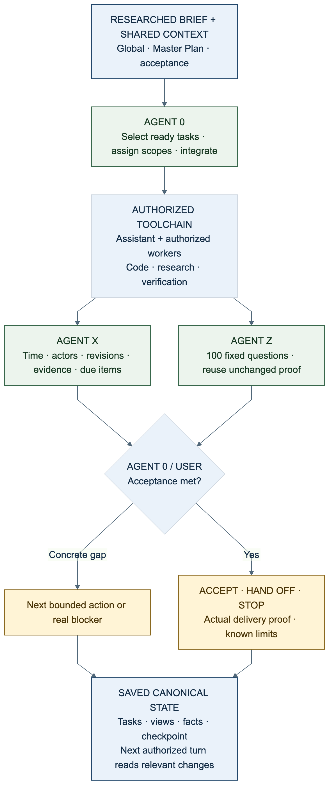

# .SYSTEMX


**DOT SYSTEMX is portable project memory and coordination for work with AI assistants.**
It keeps the objective, plan, tasks, evidence, and next step in a reviewable folder
that people and their tools can carry across sessions. The canonical folder name
is exactly **`.SYSTEMX`**.

A product of **Wayne Tech Lab LLC**, created by **Lucas (SatoshiUNO)**.
[Portfolio: Networks.Chat](https://Networks.Chat) ·
[Business: WayneTechLab.com](https://WayneTechLab.com)

[Use this template](https://github.com/WayneTechLab/dotSYSTEMX/generate) ·
[First-time setup](https://github.com/WayneTechLab/dotSYSTEMX/wiki/First-Time-Setup) ·
[Manual](https://github.com/WayneTechLab/dotSYSTEMX/wiki) ·
[Illustrated white paper](https://github.com/WayneTechLab/dotSYSTEMX/wiki/White-Paper)

> **ALPHA — USE AT YOUR OWN RISK.** The format may change daily and is provided
> without warranty. Review and pin a release, keep recoverable backups, and
> validate the result in your own project. Template checks do not certify an
> application or process as production ready. See the
> [release policy](https://github.com/WayneTechLab/dotSYSTEMX/wiki/Release-Policy)
> and [version history](https://github.com/WayneTechLab/dotSYSTEMX/wiki/Versions-and-Changelog).

## Quick start: add `.SYSTEMX` to a local project

Run this from the **containing project directory** on macOS or Linux. You need
Python 3.9+ and Git. The isolated Python environment lives outside the project;
the first `first-run` command previews changes before you apply them. This
example selects the reviewed `v1.8.9-alpha.1` release and leaves updates manual.

```bash
python3 -m venv "$HOME/.venvs/dotsystemx"
"$HOME/.venvs/dotsystemx/bin/python" -m pip install \
  "git+https://github.com/WayneTechLab/dotSYSTEMX.git@v1.8.9-alpha.1"
systemx() { "$HOME/.venvs/dotsystemx/bin/python" -I -B -m systemx "$@"; }

systemx first-run --target "$PWD" --profile project --version 1.8.9-alpha.1
systemx first-run --target "$PWD" --profile project --version 1.8.9-alpha.1 --apply
systemx status --target "$PWD"
systemx run --target "$PWD" --offline -- validate
```

The preview and apply commands retrieve the exact release but do not include an
independent archive digest in this short example. For a SHA-256-pinned remote
install, use the release's **codeload tag ZIP** digest with `--archive-sha256`,
obtained from a separately trusted record. The
[installation guide](https://github.com/WayneTechLab/dotSYSTEMX/wiki/Installation-and-Updates)
explains that trust boundary, verification, migration, and removal. The
[Windows PowerShell path](https://github.com/WayneTechLab/dotSYSTEMX/wiki/First-Time-Setup)
and [chat or Drive profiles](https://github.com/WayneTechLab/dotSYSTEMX/wiki/Getting-Started)
have their own setup steps. A URL alone does not grant an AI chat access to files
or make its records persist.

After installation, fill in only facts you know: `.SYSTEMX/GLOBAL/CONTEXT.md`,
`.SYSTEMX/PLAN/MASTER-PLAN.md`, and the first task in the canonical ledger.
Read `.SYSTEMX/START-HERE.md` and the
[daily workflow](https://github.com/WayneTechLab/dotSYSTEMX/wiki/Daily-Workflow)
before asking an assistant to continue the work. Validation checks the format;
it does not prove the project's build, deployment, or live behavior.

## Why I started it

I started `.SYSTEMX` to keep my local scripts and TODO folder in sync while I
worked on a project. I needed one place to see what was next, what was under way,
and what was actually done. Over the last year it grew within a larger Firebase
and Google Cloud template into a stack-neutral format for project context, a
Master Plan, task ownership, evidence, and Agent 0 coordination. The standalone
template makes those records reusable without requiring that original stack.

The long-term ambition is to keep an assistant oriented through **10,000 or more
task-based events**. That is a design goal, not a benchmark or a promise of
autonomous completion. The [founder's note](https://github.com/WayneTechLab/dotSYSTEMX/wiki/About)
and [long-running work guide](https://github.com/WayneTechLab/dotSYSTEMX/wiki/Anti-Drift-and-Long-Running-Work)
describe the origin and the practical limits.

“DOT” comes from the leading period in `.SYSTEMX`. Dot-prefixed names are
conventionally hidden in ordinary macOS/Linux listings; Windows uses a separate
hidden attribute. Hidden does not mean private, encrypted, or excluded from Git.
**Keep the dot and uppercase letters exactly.** On a case-sensitive filesystem,
`.systemx` can become a second, conflicting directory. Setup can optionally
create a lowercase compatibility link where supported; see
[exact-case setup](https://github.com/WayneTechLab/dotSYSTEMX/wiki/Exact-Case-and-Alias).

## How the system coordinates work

[](https://github.com/WayneTechLab/dotSYSTEMX/wiki/Visual-Guide)

1. **Define and plan:** record the purpose, constraints, milestones, and acceptance
   criteria. Agent 0 turns the next part of the plan into bounded tasks.
2. **Execute and log:** a person, assistant, or authorized subagent works within
   scope. Agent X can record meaningful actor, time, revision, and due-item events.
3. **Check and accept:** Agent Z can score evidence against a versioned set of 100
   questions in 10 categories. Agent 0 and the user decide whether the original
   acceptance criteria were met, then save the next step or completion evidence.

| Responsibility | Canonical record |
| --- | --- |
| Shared context and constraints | `.SYSTEMX/GLOBAL/CONTEXT.md` |
| Reviewed access decisions and gaps | `.SYSTEMX/GLOBAL/ACCESS-MATRIX.md` |
| Outcomes and acceptance | `.SYSTEMX/PLAN/MASTER-PLAN.md` |
| Source locations, interfaces, and boundaries | `.SYSTEMX/PLAN/MAP.md` |
| Task status, ownership, dependencies, and evidence | `.SYSTEMX/WORK/TASKS.json` |
| Current focus and reviewed facts | `.SYSTEMX/WORK/FOCUS.json`, `.SYSTEMX/MEMORY/PROJECT.md` |
| Agent handoffs and checkpoints | `.SYSTEMX/AGENTS/<id>/MEMORY.md` and session records |
| Optional events and reviews | `.SYSTEMX/EVENTS/`, `.SYSTEMX/REVIEWS/` after role activation |

The task ledger generates TODO, WORKING-ON, BLOCKED, REVIEW, DONE, and CANCELLED
views. The public template starts with blank project records and only the
`agent.0` coordinator. Role activation registers Agent X or Z records; it does
not start a worker, schedule a job, or grant permissions. The AI app, IDE, CLI,
or other harness supplies actual models and tools. See the
[access matrix and map guide](.SYSTEMX/docs/ACCESS-AND-MAP.md) for the two
optional blank records; they are navigation and reviewed intent, not live IAM
or an automatic system inventory. See the
[Agent 0](https://github.com/WayneTechLab/dotSYSTEMX/wiki/Agent-0-and-Subagents),
[Agent X](https://github.com/WayneTechLab/dotSYSTEMX/wiki/Agent-X), and
[Agent Z](https://github.com/WayneTechLab/dotSYSTEMX/wiki/Agent-Z) manuals.

For multiple named projects, one outer `.SYSTEMX` can hold separate
`.SYSTEMX/Projects/<name>/.SYSTEMXP` records. Each child keeps its own context,
plan, tasks, and memory, and scoped commands require explicit project selection.
Do not nest a second `.SYSTEMX` inside `.SYSTEMX`. See
[SYSTEMX PROJECTS](https://github.com/WayneTechLab/dotSYSTEMX/wiki/SYSTEMX-Projects).

## Try it with an AI assistant

Once the folder is installed, accessible, and initialized for your project, a
bounded request can start like this:

```text
Finish [TASK OR OBJECTIVE] using .SYSTEMX Agent 0 with subagents.
Read the active project's context, Master Plan, task ledger, and current focus.
Use up to 10 subagents if the harness supports them and parallel work helps.
Give each worker a bounded assignment. Record verified results and the next
step; distinguish local checks from live acceptance.
```

The ten-worker number is a requested ceiling, not a guarantee of available
capacity. The folder does not launch agents. The
[prompt cookbook](https://github.com/WayneTechLab/dotSYSTEMX/wiki/Prompt-Cookbook)
and [new-chat setup prompt](https://github.com/WayneTechLab/dotSYSTEMX/wiki/New-Chat-Setup-Prompt)
show longer examples and chat-only handoffs.

## Work across tools and environments

The same records can live in a repository, local directory, synchronized Drive
folder, or a saved chat attachment when the user and tool have access. An outer
`.SYSTEMX` can also index multiple `.SYSTEMXP` projects. Use one canonical writer
per scope and verify saved revisions before another session writes. Cloud URLs
identify a location; they do not connect a service by themselves.

[Four use-case walkthroughs and 4K graphics](https://github.com/WayneTechLab/dotSYSTEMX/wiki/Use-Case-Infographics)
cover ChatGPT with Google Drive, Codex with a GitHub project, Dots/Codex Cloud,
and Codex/Copilot CLI with a local drive. The
[media library](.SYSTEMX/MEDIA/README.md) holds the downloads and text guides.
For a researched brief that becomes phases, milestones, tasks, and review waves,
see the [one-shot project guide](https://github.com/WayneTechLab/dotSYSTEMX/wiki/One-Shot-Project-Guide).
“One shot” describes the starting brief, not a promise of completion in one
response.

## Versions, evidence, and limits

New installations pin their selected defaults version and use manual updates.
An optional startup check **reports** a newer release; it does not download or
select it. Normal updates add new versioned defaults and preserve existing
project records and earlier files. Changing a stock root launcher can require
an explicit, backed-up bootstrap refresh. Read the
[upgrade](https://github.com/WayneTechLab/dotSYSTEMX/wiki/Installation-and-Updates)
and [uninstall/restore](https://github.com/WayneTechLab/dotSYSTEMX/wiki/Uninstall-and-Cleanup)
instructions before changing an active project.

Focused handoffs may avoid rereading long chats, repeating searches, or
replanning accepted work. That can save input tokens, processing time, and
usage-based API costs in some workflows. Maintaining records and using extra
agents also costs tokens and time; no fixed savings have been measured or
guaranteed. This is a coordination and memory pattern, **not AGI or model
retraining**. [Efficiency and measurement](https://github.com/WayneTechLab/dotSYSTEMX/wiki/Tokens-Cost-and-Time)
and [evidence rules](https://github.com/WayneTechLab/dotSYSTEMX/wiki/Evidence-and-Acceptance)
explain how to test the benefit and report completion honestly.

The template does not install a Firebase app, cloud service, agent runtime, or
MCP server. It does not make an existing project production ready. The
[Technical Guide](https://github.com/WayneTechLab/dotSYSTEMX/wiki/Technical-Guide)
and [Stack Guide](https://github.com/WayneTechLab/dotSYSTEMX/wiki/Stack-Guide)
explain its current implementation and how to connect real project commands.

## Manual, support, and attribution

The [wiki](https://github.com/WayneTechLab/dotSYSTEMX/wiki) is the manual for
setup, record formats, roles, prompts, operations, and release history. The
[illustrated white paper](https://github.com/WayneTechLab/dotSYSTEMX/wiki/White-Paper)
contains the deeper coordination diagrams and implementation discussion.

[Contributing](CONTRIBUTING.md) · [Support](SUPPORT.md) ·
[Security](SECURITY.md) · [MIT License](LICENSE)

Maintained by **[Wayne Tech Lab LLC](https://github.com/WayneTechLab)**. This
standalone template was extracted from
[SFWA-WTL-TEMPLATE](https://github.com/WayneTechLab/SFWA-WTL-TEMPLATE);
[source provenance](.SYSTEMX/SOURCE.json) records that relationship. Keep
private project records out of public exports and retain the license and
attribution when redistributing the folder.
